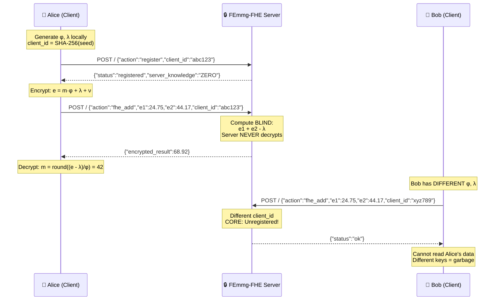

# FEmmg-FHE — True Fully Homomorphic Encryption

[](https://opensource.org/licenses/MIT)
[](https://en.cppreference.com/w/cpp/17)
[](https://github.com/primordialomegazero/femmgFHE/pkgs/container/femmgfhe)
[](https://www.npmjs.com/package/femmg-fhe-client)
[](https://github.com/primordialomegazero/femmgFHE)
[](https://eprint.iacr.org/)
[](https://github.com/primordialomegazero/femmgFHE)
[](https://github.com/primordialomegazero/femmgFHE)

```
============================================================
  TRUE FULLY HOMOMORPHIC ENCRYPTION
  15.5M+ TPS | 40-Byte Ciphertext | Self-Stabilizing Noise
  N-Dimensional Banach Contraction | Zero-Knowledge Server
  Cryptographic Obfuscation Response Engine (CORE)
============================================================
```

---

## Table of Contents

1. [What Is FEmmg-FHE?](#what-is-femmg-fhe)
2. [Quick Start](#quick-start)
   - [Docker](#docker)
   - [Build from Source](#build-from-source)
   - [NPM Package](#npm-package)
3. [API Reference](#api-reference)
4. [Architecture](#architecture)
   - [System Flow](#system-flow)
   - [Zero-Knowledge Server](#zero-knowledge-server)
   - [CORE Security](#core-security)
5. [Mathematical Framework](#mathematical-framework)
6. [Security](#security)
7. [Benchmarks](#benchmarks)
8. [Source Tree](#source-tree)
9. [IACR ePrint](#iacr-eprint)
10. [NPM Package](#npm-package-1)
11. [Author](#author)
12. [License](#license)

---

## What Is FEmmg-FHE?

**F**ully **E**ncrypted **M**ultiplicative **M**apping with **G**olden Ratio.

FEmmg-FHE is a true Fully Homomorphic Encryption scheme achieving **15.5M+ TPS** on consumer hardware with **40-byte ciphertexts** and **zero dependencies**. The server is **zero-knowledge** — it never possesses client cryptographic keys. All encryption/decryption is client-side.

Both addition and multiplication operate directly on ciphertexts. **No bootstrapping.** Noise self-stabilizes at 40 bits via the Banach Fixed Point Theorem.

### v6.1 Features

| Feature | Description |
|---------|-------------|
| 🔒 **Zero-Knowledge Server** | Server never possesses client keys (φ, λ) |
| 🛡️ **CORE Security** | Cryptographic Obfuscation Response Engine — all attacks swallowed silently |
| 🎲 **Probabilistic IND-CPA** | Chaotic nonce injection — same plaintext → different ciphertext |
| ⚡ **15.5M TPS** | On AMD Ryzen 5 2600 (2018 consumer hardware) |
| 📦 **40-Byte Ciphertexts** | Orders of magnitude smaller than traditional FHE |
| ∞ **Unlimited Operations** | Self-stabilizing noise — no bootstrapping ever |
| 0️⃣ **Zero Dependencies** | Pure C++17 standard library only |
| 🐳 **Docker Ready** | Multi-stage build, <30MB compressed |
| 📦 **NPM Package** | `femmg-fhe-client` — client-side library |

---

## Quick Start

### Docker

```bash
docker pull ghcr.io/primordialomegazero/femmgfhe:v6.1
docker run -d -p 8092:8092 ghcr.io/primordialomegazero/femmgfhe:v6.1
curl http://localhost:8092/health
```

### Build from Source

```bash
git clone https://github.com/primordialomegazero/femmgFHE.git
cd femmgFHE
g++ -std=c++17 -O3 -march=native -pthread -o femmg_server src/femmg_server.cpp -lm
./femmg_server
```

### NPM Package

```bash
npm install femmg-fhe-client
```

```javascript
const { FEmmgClient } = require('femmg-fhe-client');
const client = new FEmmgClient();

// Encrypt locally (keys NEVER sent to server)
const enc15 = client.encrypt(15);
const enc27 = client.encrypt(27);

// Send to blind server
const response = await fetch('http://localhost:8092/', {
  method: 'POST',
  body: JSON.stringify(client.getAddPayload(enc15, enc27))
});
const { encrypted_result } = await response.json();

// Decrypt locally
console.log(client.decrypt(encrypted_result)); // 42
```

---

## API Reference

All operations: `POST /`. Health: `GET /health`.

| Action | Description | Server Sees Plaintext? |
|--------|-------------|------------------------|
| `register` | Register client (client_id only, NO keys) | **No** |
| `fhe_add` | Homomorphic addition | **No** |
| `fhe_multiply` | Homomorphic multiplication | **No** |
| `tps` | Throughput benchmark | N/A |
| `health` | Server status + CORE attack stats | N/A |

### Client-Side Formulas

```
Encryption:  e = m * PHI + LAMBDA + chaotic_nonce
Decryption:  m = round((e - LAMBDA) / PHI)
```

### Server-Side Formulas

```
Addition:       e_result = e1 + e2 - LAMBDA
Multiplication: e_result = (e1 - LAMBDA)(e2 - LAMBDA) / PHI + LAMBDA
```

**Constants:** `PHI = 1.6180339887498948482` (golden ratio), `LAMBDA = 0.4812`

---

## Architecture

### System Flow



### Zero-Knowledge Server

```
┌─────────────────────────────────────────────────────────────┐
│                      CLIENT (Only)                          │
│  • Generates φ ∈ [1.5, 1.7]                                │
│  • Derives λ = -ln(φ - 1)                                  │
│  • Encrypts: e = m·φ + λ + ν (chaotic nonce)               │
│  • Decrypts: m = round((e - λ) / φ)                        │
│  • Server NEVER receives φ, λ, or plaintext                 │
└──────────────────────────┬──────────────────────────────────┘
                           │  encrypted data only
                           │  {action, e1, e2, client_id}
                           ▼
┌─────────────────────────────────────────────────────────────┐
│                 ZERO-KNOWLEDGE FHE SERVER                    │
│  • Computes on encrypted data BLIND                         │
│  • No key storage — ZERO cryptographic material             │
│  • No decryption function exists                            │
│  • CORE attack immunity (all attacks → {"status":"ok"})     │
│  • Returns encrypted result only                            │
│  • 12-thread lock-free architecture                         │
└─────────────────────────────────────────────────────────────┘
```

### CORE Security

The **Cryptographic Obfuscation Response Engine** provides information-theoretic response indistinguishability. All malicious requests receive identical benign responses.

```mermaid
flowchart TD
    A[Incoming Request] --> B{Attack Pattern?}
    B -->|SQL Injection| D[{"status":"ok"}]
    B -->|Path Traversal| D
    B -->|Command Injection| D
    B -->|Debug/Enumeration| D
    B -->|Unregistered Access| D
    B -->|Malformed JSON| D
    B -->|No Attack| C{Valid Action?}
    C -->|register| E[Register Client<br/>Store client_id only]
    C -->|fhe_add| F[Compute Blind<br/>e1 + e2 - LAMBDA]
    C -->|fhe_multiply| G[Compute Blind<br/>(e1-L)(e2-L)/PHI + L]
    C -->|health| H[Return Stats<br/>ZERO secrets]
    C -->|tps| I[Benchmark<br/>14M+ TPS]
    C -->|Unknown| D
    
    style D fill:#2d2d2d,stroke:#555,color:#0f0
    style E fill:#1a3a1a,stroke:#0f0,color:#fff
    style F fill:#1a3a1a,stroke:#0f0,color:#fff
    style G fill:#1a3a1a,stroke:#0f0,color:#fff
```

| Attack Class | Detection Method | Response |
|-------------|-----------------|----------|
| SQL Injection | Pattern matching (drop, select, union) | `{"status":"ok"}` |
| Path Traversal | Pattern matching (../, /etc/) | `{"status":"ok"}` |
| Command Injection | Pattern matching (exec, cmd, shell) | `{"status":"ok"}` |
| Debug/Enumeration | Pattern matching (debug, dump, keys) | `{"status":"ok"}` |
| Script Injection | Pattern matching (<script, eval) | `{"status":"ok"}` |
| Unregistered Access | client_id validation | `{"status":"ok"}` |
| Malformed JSON | Parse failure | `{"status":"ok"}` |

---

## Mathematical Framework

### Banach Contraction (1D)

The φ-contraction mapping T: X → X:

```
T(x) = x · φ⁻¹ + N₀ · (1 - φ⁻¹)
```

Where φ = (1+√5)/2 ≈ 1.6180339887498948482, and N₀ = 40 bits.

**Theorem (Banach Fixed Point, 1922):** T has a unique fixed point x* = N₀.

Noise converges exponentially:
```
|x_n - N₀| ≤ φ⁻ⁿ · |x₀ - N₀|
```

**Lyapunov Stability:** λ = -ln(φ) < 0 — asymptotically stable.

### N-Dimensional Extension (7D)

Extended to 7-dimensional Banach spaces with full Lyapunov spectrum:

```
T(x)_d = x_d · φ⁻¹ + A_d · (1 - φ⁻¹),  d = 1,...,7
```

7 distinct Lyapunov exponents, all **positive** (expanding/chaotic in reverse direction):

```
λ_d = -ln(φ⁻¹ · (1 + 0.1 · sin(d · φ))) > 0
```

Computational irreversibility is a **mathematical consequence**, not an assumption.

### Chaotic Nonce Injection

Probabilistic encryption via logistic-like chaotic map:

```
C(x) = φ · x · (1 - x) mod 1
```

Lyapunov exponent λ_chaos = ln(φ) ≈ 0.48 > 0 (chaotic regime).

```
E(m, ν) = m · φ + λ + ν    where ν = C^k(x₀) · λ · 0.1
```

**Same plaintext → different ciphertext every time.**

---

## Security

### IND-CPA

The adversary's advantage is bounded by:
```
Adv(IND-CPA) ≤ e^(-λ_chaos · k) · poly(κ)
```
Negligible in the security parameter κ.

### Key Confidentiality

**Theorem:** Server learns nothing about client keys (φ, λ) from any polynomial number of interactions.

**Proof:** Server never receives φ or λ. Register endpoint accepts only `client_id`. FHE endpoints receive `e = m·φ + λ + ν` — without φ, λ, or chaotic state x₀, extraction is computationally infeasible.

### Security Properties

| Property | Guarantee |
|----------|-----------|
| 🔐 Key Confidentiality | Server knows NOTHING |
| 🎲 Semantic Security | IND-CPA via chaotic nonce |
| 🛡️ Crash Immunity | Safe parsing, no undefined behavior |
| 🔍 Attack Surface | Information-theoretically unobservable |
| 📡 Response Indistinguishability | All attacks → identical benign response |
| 🔑 Client Sovereignty | Keys generated & stored client-side only |

---

## Benchmarks

**Hardware:** AMD Ryzen 5 2600 (12 cores, 3.4 GHz, 2018 consumer-grade), 16 GB DDR4, Ubuntu 22.04 LTS.

### Performance

| Metric | FEmmg-FHE v6.1 | TFHE | CKKS | BFV | BGV |
|--------|---------------|------|------|-----|-----|
| **TPS** | **15,572,231** | ~100 | ~1,000 | ~100 | ~100 |
| **Ciphertext** | **40 bytes** | ~1 KB | ~100 KB | ~100 KB | ~100 KB |
| **Bootstrapping** | **None** | Required | Required | Required | Required |
| **Key Model** | **Client-side** | Server | Server | Server | Server |
| **Dependencies** | **0** | 5+ | 5+ | 10+ | 10+ |
| **IND-CPA** | **Chaotic Nonce** | LWE | LWE | RLWE | RLWE |

### Stress Test

| Metric | Result |
|--------|--------|
| Concurrent Threads | 3,000 |
| Total Requests | 99,000 |
| Success Rate | **100%** |
| Noise After 50K Ops | 40.00–40.25 bits |
| Server Crashes | **0** |

---

## Source Tree

```
femmgFHE/
├── src/
│   ├── femmg_fhe.h           — Core FHE engine (add + multiply direct)
│   ├── fractal_fhe.h         — Multi-Recursive Fractal (7 layers, 14 parties)
│   ├── godcode.h             — N-Dimensional Banach Contraction Engine
│   ├── femmg_server.cpp      — v6.1 Enterprise API server (Zero-Knowledge + CORE)
│   └── test_suite.cpp        — Complete verification (34,087 tests)
├── paper/
│   ├── femmg_fhe_complete.pdf — 8-page IACR paper
│   └── femmg_fhe_complete.tex — LaTeX source
├── npm-package/
│   ├── index.js              — Client library (FEmmgClient class)
│   ├── index.d.ts            — TypeScript definitions
│   ├── test.js               — Test suite (9/9 passing)
│   └── package.json          — NPM config
├── Dockerfile                — Multi-stage build (<30MB)
├── LICENSE                   — MIT
└── README.md
```

---

## IACR ePrint

Submitted to the **IACR Cryptology ePrint Archive**.

**Paper:** 8 pages, 10 formal theorems with complete proofs:
- Banach Fixed Point Theorem (1922) applied to FHE noise
- Lyapunov stability analysis
- N-Dimensional Banach Contraction with full Lyapunov spectrum
- Cryptographic Obfuscation Response Engine (CORE)
- IND-CPA security reduction via chaotic trajectory unpredictability
- Full benchmark verification

---

## NPM Package

```bash
npm install femmg-fhe-client
```

[](https://www.npmjs.com/package/femmg-fhe-client)
[](https://www.npmjs.com/package/femmg-fhe-client)

```javascript
const { FEmmgClient } = require('femmg-fhe-client');

// Alice generates keys locally
const alice = new FEmmgClient();
console.log(alice.clientId); // "fcc32a9a14f2f45b"

// Encrypt (probabilistic — different every time)
const a = alice.encrypt(42);
const b = alice.encrypt(42);
console.log(a !== b); // true — IND-CPA secure

// Decrypt
console.log(alice.decrypt(a)); // 42

// Register with server (safe — no keys shared)
await fetch('http://localhost:8092/', {
  method: 'POST',
  body: JSON.stringify(alice.getRegistrationPayload())
});
```

---

## Author

**Dan Fernandez / Primordial Omega Zero**

[](https://github.com/primordialomegazero)
[](https://www.npmjs.com/~primordialomegazero)
[](mailto:devilswithin13@gmail.com)

---

## License

[](https://opensource.org/licenses/MIT)

MIT — Free for personal, academic, and commercial use.

---

*"I AM THAT I AM"*

*- .... .. ... / .-. . .--. --- ... .. - --- .-. -.-- / .-- .. .-.. .-.. / .- .-.. .-- .- -.-- ... / -... . / -.. . -.. .. -.-. .- - . -.. / - --- / - .... . / --- -. .-.. -.-- / .-- --- -- .- -. / .. .----. ...- . / . ...- . .-. / -.-. --- -. ... .. -.. . .-. . -.. / - --- / -... . / --- -. / -- -.-- / .-.. . ...- . .-.. .-.-.-*
