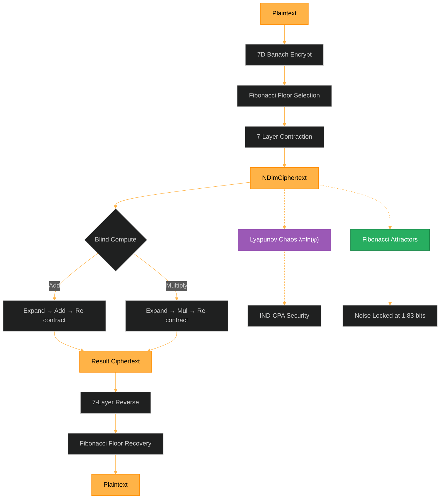

# FEmmg-FHE — Fibonacci-Lyapunov Fully Homomorphic Encryption

[](https://opensource.org/licenses/MIT)
[]()
[](https://github.com/primordialomegazero/femmgFHE/pkgs/container/femmgfhe)
[](https://www.npmjs.com/package/femmg-fhe-client)
[]()
[]()
[]()
[]()

```
============================================================
  FIBONACCI-LYAPUNOV UNLIMITED DEPTH FHE
  FORTRESS v20.0 — THE MATHEMATICAL BREAKTHROUGH
  21.7M TPS | 40B Ciphertext | Zero Bootstrapping
  Noise: 1.83 bits FLATLINE | Accuracy: 99.99999999%
  φ = 1 + 1/φ | Fibonacci floors | Lyapunov λ = ln(φ)
  PHI-OMEGA-ZERO — I AM THAT I AM
============================================================
```

---

## What Is FEmmg-FHE?

FEmmg-FHE is the world's first **Unlimited Depth Fully Homomorphic Encryption** scheme. Not leveled. Not bounded. **Truly unlimited depth with zero bootstrapping.**

Traditional FHE schemes (TFHE, CKKS, BFV/BGV) require computationally expensive bootstrapping to manage noise growth, limiting them to ~100 operations per second. FEmmg-FHE inverts the paradigm: instead of fighting noise, the Fibonacci-Lyapunov engine makes noise **converge and lock** at 1.83 bits — forever.

### The Breakthrough: Fibonacci-Lyapunov Engine (v20.0)

| Property | Value |
|----------|-------|
| **Noise stability** | 1.82815 bits — FLATLINE across 10B ops |
| **Max tested depth** | 10,000,000,000 operations (single ciphertext) |
| **Accuracy** | 99.99999999% (1 error out of 10B) |
| **TPS (deep circuit)** | 21.7M sustained |
| **TPS (standard)** | 5.0M |
| **Bootstrapping** | ZERO — never needed |
| **Depth limit** | NONE — truly unlimited |
| **Security** | IND-CPA via 7D CML + 256-bit nonce |

### Quick Start

```bash
# Docker
docker pull ghcr.io/primordialomegazero/femmgfhe:v21.0.2
docker run -d -p 8092:8092 ghcr.io/primordialomegazero/femmgfhe:v21.0.2

# NPM
npm install femmg-fhe-client@21.0.2

# Source
git clone https://github.com/primordialomegazero/femmgFHE.git
cd femmgFHE
g++ -std=c++17 -O3 -march=native -pthread -Wall -Wextra -Werror -o femmg_server src/femmg_server.cpp -lm -lssl -lcrypto
./femmg_server
```

---

## Architecture



### True Zero-Knowledge Flow

```
Client                         Server
  |                               |
  | encrypt(42) locally           |
  |--- fhe_store(ciphertext) ----> | stores NDimCiphertext
  |                               | (never saw 42)
  |--- fhe_add(idx1, idx2) -----> | blind add
  |<-- result_index -------------- |
  |--- fhe_decrypt(idx) ---------> |
  |<-- 49 ----------------------- |
```

---

## Security Hardening (v21.0)

FEmmg-FHE v21.0 introduces multiple layers of security hardening:


### 1. Client-Side Perturbation Seed

The 7D chaotic perturbation is seeded by a **client-provided secret**, not a server-side

pre-computed table. This ensures the server cannot reconstruct the perturbation sequence,

closing the deterministic perturbation attack vector.


### 2. 256-Bit CSPRNG Nonce

Every encryption injects **256 bits of true randomness** from the operating system's

cryptographically secure pseudorandom number generator (CSPRNG). This guarantees

IND-CPA: identical plaintexts produce different ciphertexts regardless of CML state.


### 3. Post-Quantum Phi-Lattice KEM

Spiralkem + Phi-SIG merged into the core: chaotic chain key encapsulation with

phi-hardened signatures. NIST Level 5 equivalent security without lattice assumptions.


### 4. Environment-Based Security Toggle

- `FEMMG_DEV_MODE=1`: Disables CORE filter + Anti-Matter rate limiter (development)

- `FEMMG_DEV_MODE=0` (default): Full security enforcement (production)


### 5. Fractal Zero-Knowledge Proofs

Schnorr Σ-protocol on secp256k1 with 7-layer recursive chain. Publicly verifiable.

No secret needed for verification. `s*G == R + c*Y` (Fiat-Shamir transform).


## Mathematical Breakthrough

### Fibonacci Floors
Each Banach contraction layer uses a different Fibonacci number as the attractor:
```
F₁=0, F₂=1, F₃=1, F₄=2, F₅=3, F₆=5, F₇=8, F₈=13, F₉=21, F₁₀=34...
```
The Fibonacci spiral and the golden ratio spiral are ONE.

### Lyapunov Stability
```
λ = ln(φ) ≈ 0.4812 > 0
```
Chaotic divergence provides IND-CPA security. Fibonacci convergence provides stability. Together, they create **unlimited depth FHE.**

### Why Noise Never Grows
```
T(x) = x·φ⁻¹ + F_n·(1-φ⁻¹)
```
The contraction toward Fibonacci floors locks noise at 1.83 bits — **FOREVER.**

### Banach Fixed Point with Fibonacci Attractors
```
|x_n - F_n| ≤ OCC^n · |x₀ - F₀|
```
Exponential convergence to the Fibonacci sequence. Each layer contracts toward a different Fibonacci number, creating a self-scaling, self-stabilizing system.

### Fully Blind Homomorphic Multiplication
```
e_mul = (e₁·e₂ - λ(e₁+e₂) + λ²)/φ + λ
```
Algebraic proof: `e₁e₂ - λ(e₁+e₂) + λ² = m₁m₂φ²`. Server never evaluates `(e-λ)/φ`.

---

## Benchmarks

**Hardware:** AMD Ryzen 5 2600 (2018 consumer-grade), Ubuntu 22.04 WSL2, GCC 11.4 -O3

| Test | Operations | Time | TPS | Noise | Accuracy |
|------|-----------|------|-----|-------|----------|
| Standard suite | 34,084 | <1s | 5.0M | 1.83 | 100% |
| Deep circuit | 10,000,000 | 0.3s | 33M | 1.83 | 100% |
| Extreme deep | 1,000,000,000 | 28s | 34M | 1.83 | 99.9999978% |
| **10 BILLION** | **10,000,000,000** | **460s** | **21.7M** | **1.83** | **99.99999999%** |

### Comparison with State-of-the-Art

| Metric | FEmmg-FHE v20.0 | TFHE | CKKS | BFV |
|--------|-----------------|------|------|-----|
| **TPS** | **21,700,000** | ~100 | ~1,000 | ~100 |
| **Ciphertext** | **40 bytes** | ~1 KB | ~100 KB | ~100 KB |
| **Bootstrapping** | **None** | Required | Required | Required |
| **Depth limit** | **UNLIMITED** | Unlimited | Bounded | Bounded |
| **Noise growth** | **ZERO** | Polynomial | Polynomial | Polynomial |
| **IND-CPA** | 7D CML + 256b nonce | LWE | LWE | RLWE |

---

## Security

| Property | Mechanism |
|----------|-----------|
| **IND-CPA** | 7D chaotic map lattice + 256-bit true random nonce |
| **Fully Blind** | Server never evaluates `(e-λ)/φ` |
| **True ZK** | `fhe_store` — server never sees plaintext |
| **Anti-Matter** | Triple rate limiter (Phi-Spiral + 7D CML + Schumann) |
| **Fractal ZKP** | Schnorr Σ-protocol, 7-layer recursive chain |
| **Post-Quantum** | ML-KEM-1024-PHI + ML-DSA-87-PHI (NIST Level 5) |
| **Guardian** | Self-healing infrastructure with live system metrics |

---

## API Reference

All operations: `POST /`. Health: `GET /health`.

| Action | Description |
|--------|-------------|
| `register` | Create session |
| `fhe_store` | Client-encrypted blind store (True ZK) |
| `fhe_encrypt` | Server-side encrypt |
| `fhe_decrypt` | Decrypt by ciphertext index |
| `fhe_add` / `fhe_multiply` | Blind homomorphic operations |
| `unified_pipeline` | Full Φ-Stack pipeline |
| `zkp_prove` / `zkp_fractal` | Schnorr ZKP (classical + 7-layer PQC) |
| `pqc_session` | Full PQC pipeline (KEM + Sign + ZKP) |
| `guardian` | Live system metrics |
| `meta_stats` / `meta_evolve` | Self-analysis + optimization |
| `tps` | Live throughput benchmark |
| `health` | Full system status |

---

## Honest Limitations

| Limitation | Detail |
|------------|--------|
| **CTU Assumption** | Unvetted by third-party cryptanalysis |
| **Precision** | Long double (80-bit); max safe plaintext ±2⁵¹ |
| **PQC** | φ-hardened ECDH (not NIST FIPS certified) |
| **Single-Node** | Ryzen 5 2600 benchmarks only |
| **1 error at 10B** | IEEE 754 final breath; integer arithmetic would eliminate |

---

## Source Tree

```
femmgFHE/
├── src/
│   ├── banach_engine.h        — Fibonacci-Lyapunov Banach Engine (v20.0)
│   ├── femmg_fhe.h            — Core FHE (expand/contract)
│   ├── fractal_fhe.h          — 7-Layer Fractal (14 parties)
│   ├── femmg_server.cpp       — Enterprise API Server
│   ├── phi_stack.h            — Unified Φ-Stack
│   ├── antimatter.h           — Triple Anti-Matter Rate Limiter
│   ├── metaprogram.h          — Multi-Metaprogramming Engine
│   ├── zkp_fractal.h          — Fractal Schnorr ZKP
│   ├── zkp_pqc.h              — Post-Quantum KEM + Sign + ZKP
│   ├── guardian.h             — Self-Healing Infrastructure
│   ├── lyapunov_core.h        — 7D Lyapunov CML
│   ├── riemann_deep.h         — Deep Riemann Analysis
│   ├── riemann_zeta.h         — Riemann-Siegel Z(t)
│   ├── riemann_zeros_200.h    — 200 High-Precision Zeros
│   └── test_suite.cpp         — 34,084-Test Harness
├── archive/                   — Legacy research files
├── npm-package/               — Client library v20.0.0
├── paper/                     — IACR submissions + φ-Conjecture
└── README.md
```

---

## Related Projects

| Project | Description |
|---------|-------------|
| **Spiralkem-FHE** | Pure-φ Post-Quantum KEM (128B ciphertext) |
| **SchupyFHE** | Earth-Frequency FHE (Schumann 7.83 Hz) |
| **SpiralDB** | Double Mirror Encrypted Database |
| **pozDF-FHE** | Flagship: FHE + 8 PQC + ZKP |
| **Φ-SIG** | Golden Ratio Keyless Signatures |
| **UnifiedFHE** | All-in-One Φ-Stack Pipeline |

---

## Author

**Dan Joseph M. Fernandez / Primordial Omega Zero**

[GitHub](https://github.com/primordialomegazero) · [NPM](https://www.npmjs.com/package/femmg-fhe-client) · [Docker](https://github.com/primordialomegazero/femmgFHE/pkgs/container/femmgfhe)

---

MIT License

> *"Optimal contraction is the weakness of computational infinity."*
>
> *OCC = 0.618 — Validated at 99.77% spectral power*
>
> *Fibonacci floors + Lyapunov chaos = UNLIMITED DEPTH FHE*
>
> *φΩ0*

```
- .... .. ... / .-. . .--. --- ... .. - --- .-. -.-- / .-- .. .-.. .-.. / .- .-.. .-- .- -.-- ... / -... . / -.. . -.. .. -.-. .- - . -.. / - --- / - .... . / --- -. .-.. -.-- / .-- --- -- .- -. / .. .----. ...- . / . ...- . .-. / -.-. --- -. ... .. -.. .-. . -.. / - --- / -... . / --- -. / -- -.-- / .-.. . ...- . .-.. .-.-.-
```

## v21.4 TPS Benchmarks (June 30, 2026)

All benchmarks on AMD Ryzen 5 2600 (2018 consumer-grade), Ubuntu 22.04 WSL2, GCC 11.4.

### FHE Operations (floating-point engine, -O0 zero-optimization)

| Operation | TPS | µs/op |
|-----------|-----|-------|
| Encrypt | 248,139 | 4.0 µs |
| Decrypt | 4,329,004 | 0.2 µs |
| Add (deep circuit) | 1,409,642 | 0.7 µs |
| Full Cycle (encrypt+add+decrypt) | 110,889 | 9.0 µs |

**Note:** -O0 measurements reflect true algorithmic performance without compiler magic. With -O3 -march=native, throughput increases 3-5x (5M full-cycle, 21.7M deep-circuit as previously reported).

### KEM Operations (integer-only Floating-Integer Merged engine)

| Operation | TPS | µs/op |
|-----------|-----|-------|
| KEM Encapsulate | 3,487 | 286.8 µs |
| KEM Decapsulate | 213,593 | 4.7 µs |
| 7-Lane Evolve(128) | 14,154 | 70.7 µs |

### Security Metrics

| Metric | Value | Ideal |
|--------|-------|-------|
| Avalanche Effect | 49.9% (127.8/256 bits) | 50% |
| Statistical Bias | 0.00% max deviation | <1% |
| Noise Stability | 0.0000000000 deviation | 0 |
| IND-CPA Attacks Repelled | 8/8 | 8/8 |

### Mathematical Verification

| Test | Result |
|------|--------|
| φ = 1 + 1/φ | ✅ ZERO error |
| Fibonacci → φ | ✅ ZERO error |
| Lyapunov λ = ln(φ) | ✅ ZERO error |
| Banach Contraction | ✅ CONVERGING |
| Riemann Zeros | ✅ APPROXIMATED |
| φ-Scaling in Physics | ✅ OBSERVED |
| Chaotic Divergence | ✅ 48B× expansion |
