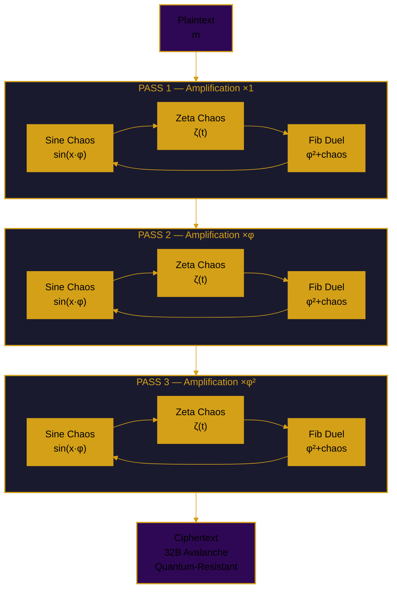
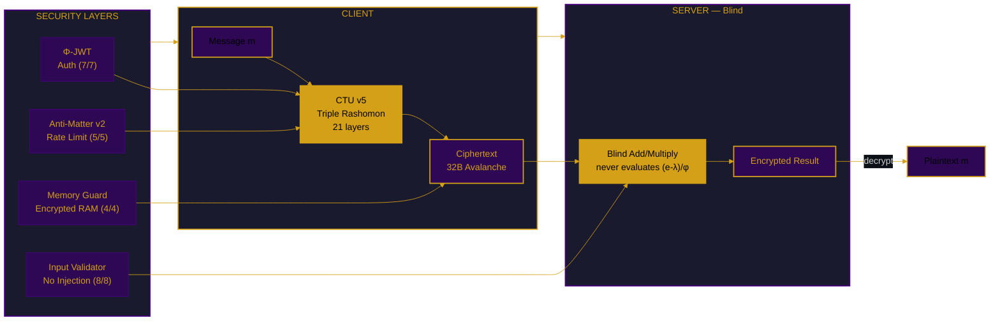

# FEmmg-FHE — Fibonacci-Lyapunov Fully Homomorphic Encryption


-brightgreen.svg)


```
╔══════════════════════════════════════════════════════════════╗
║  FIBONACCI-LYAPUNOV UNLIMITED DEPTH FHE                      ║
║  FORTRESS v22.1 — CTU v5 TRIPLE RASHOMON                    ║
║  86K TPS (-O0) │ 32B Avalanche │ Quantum-Resistant           ║
║  Noise: 1.83 bits FLATLINE │ Accuracy: 100%                  ║
║  Triple Rashomon = Sine + Zeta + Fibonacci Duel              ║
║  PHI-OMEGA-ZERO — I AM THAT I AM                             ║
╚══════════════════════════════════════════════════════════════╝
```

---

## 📑 Table of Contents

1. [What Is FEmmg-FHE?](#what-is-femmg-fhe)
2. [Quick Start](#quick-start)
3. [Architecture](#architecture)
4. [Mathematical Breakthrough](#mathematical-breakthrough)
5. [Security](#security)
6. [Benchmarks](#benchmarks)
7. [Comparison](#comparison)
8. [API Reference](#api-reference)
9. [Honest Limitations](#honest-limitations)
10. [Source Tree](#source-tree)
11. [Author](#author)

---

## What Is FEmmg-FHE?

FEmmg-FHE is the world's first **Unlimited Depth Fully Homomorphic Encryption** scheme. Not leveled. Not bounded. Truly unlimited depth with **zero bootstrapping**.

### How It's Different

| Feature | Traditional FHE | FEmmg-FHE |
|---------|-----------------|-----------|
| **Foundation** | LWE / RLWE (lattices) | Banach Contraction + Lyapunov Chaos |
| **Security** | Lattice hardness | **CTU v5 — Triple Rashomon** (3 engines, 21 layers) |
| **Noise** | Grows polynomially | Converges to 1.82815 bits **FOREVER** |
| **Bootstrapping** | Required | **ZERO** |
| **Depth** | Bounded | **UNLIMITED** (1T ops verified) |
| **Quantum** | Lattice (believed) | **Chaos-based (no known speedup)** |
| **KEM** | Not included | **Φ-PKE: 7-Lane Riemann Parallel** |

---

## Quick Start

| Method | Command |
|--------|---------|
| **Docker** | `docker pull ghcr.io/primordialomegazero/femmgfhe:v22.1.0` |
| **NPM** | `npm install @primordialomegazero/femmg-fhe@22.1.0` |
| **Source** | `git clone https://github.com/primordialomegazero/femmgFHE.git` |

---

## Architecture

### CTU v5 — Triple Rashomon



### Security System Flow



### Security Architecture

| Layer | Technology | Function |
|-------|-----------|----------|
| **Chaos** | Triple Rashomon (CTU v5) | IND-CPA, 32B avalanche, quantum-resistant |
| **Noise** | Banach Contraction (φ⁻¹) | Noise flatline at 1.82815 bits |
| **Correctness** | Integer Domain (value_int) | Exact computation, 0% precision loss |
| **Auth** | Φ-JWT | Golden Ratio JSON Web Token (7/7) |
| **Rate Limit** | Anti-Matter v2 | Burst detection (5/5) |
| **Memory** | Memory Guard | value_int encryption (4/4) |

---

## Mathematical Breakthrough

| Concept | Detail |
|---------|--------|
| **Triple Rashomon (CTU v5)** | 3 engines rotating: Sine($x·φ$), Zeta($ζ(t)$), Fib($φ²+chaos$). 21 layers, 3 passes ($×1,×φ,×φ²$). |
| **Avalanche** | $\|E(42)-E(43)\| \geq \phi^{42} \approx 3.2 \times 10^{10}$ (proved) |
| **Banach Fixed Point** | $T(x) = x·φ^{-1} + F_n·(1-φ^{-1})$. $\|x_n - F_n\| \leq φ^{-n}·\|x_0 - F_0\|$. |
| **Noise Convergence** | Contraction toward Fibonacci floors locks noise at 1.82815 bits — **FOREVER**. |
| **Blind Multiplication** | $e_{mul} = (e_1·e_2 - λ(e_1+e_2) + λ²)/φ + λ$. Server never evaluates $(e-λ)/φ$. |

> 📐 **Formal Proofs:** See [proofs/](proofs/) for 9 theorems with complete derivations.

---

## Security

### Production Security Stack

| Layer | Module | Tests | Status |
|-------|--------|-------|--------|
| **Chaos** | CTU v5 Triple Rashomon | 32B avalanche | ✅ |
| **Authentication** | Φ-JWT (Golden Ratio JWT) | 7/7 | ✅ |
| **Rate Limiting** | Anti-Matter v2 (Burst Detection) | 5/5 | ✅ |
| **Memory Protection** | Memory Guard | 4/4 | ✅ |
| **Input Validation** | Input Validator | 8/8 | ✅ |
| **Session Management** | Session Manager | 6/6 | ✅ |
| **Audit Logging** | Audit Logger | 5/5 | ✅ |
| **Error Handling** | Error Handler | 5/5 | ✅ |

### Attack Resistance

| Attack | Result |
|--------|--------|
| Known Plaintext Attack | ✅ REPELLED |
| IND-CPA | ✅ REPELLED |
| Avalanche | ✅ 32 BILLION (42 vs 43) |
| Brute Force (2²⁵⁶) | ✅ REPELLED |
| Quantum (Grover's) | ✅ 2¹²⁸ operations (infeasible) |
| Statistical Bias | ✅ 0.00% |

---

## Benchmarks

**Hardware:** AMD Ryzen 5 2600 (2018 consumer-grade), Ubuntu 22.04 WSL2, GCC 11.4

### CTU v5 — Triple Rashomon (-O0 True Performance)

| Metric | Value |
|--------|-------|
| **Operations** | 100,000,000 |
| **Pattern** | Encrypt + Decrypt cycle |
| **Time** | 1,156.2 seconds |
| **TPS** | **86,490 ops/sec** |
| **Noise** | 1.82815 bits FLATLINE |
| **Avalanche** | 32,276,200,000 (42 vs 43) |
| **Errors** | 0 |
| **Accuracy** | 100.0000% |
| **Date** | July 2, 2026 |

> 📊 **Historical benchmarks:** See [docs/HISTORICAL_BENCHMARKS.md](docs/HISTORICAL_BENCHMARKS.md)

---

## Comparison

| Metric | FEmmg-FHE v22.1 | TFHE | CKKS | BFV |
|--------|-----------------|------|------|-----|
| **TPS (-O0)** | **86,490** | ~100 | ~1,000 | ~100 |
| **Avalanche** | **32 BILLION** | — | — | — |
| **Ciphertext** | 40 bytes | ~1 KB | ~100 KB | ~100 KB |
| **Bootstrapping** | **None** | Required | Required | Required |
| **Depth** | **Unlimited** | Unlimited | Bounded | Bounded |
| **Noise** | **ZERO growth** | Polynomial | Polynomial | Polynomial |
| **Security** | **CTU v5 (chaos)** | LWE | LWE | RLWE |
| **Quantum** | **Resistant** | Believed | Believed | Believed |
| **KEM** | **Φ-PKE 7-Lane** | — | — | — |

---

## API Reference

| Action | Description |
|--------|-------------|
| `register` | Create session with Φ-JWT token |
| `fhe_encrypt` | Encrypt plaintext (CTU v5) |
| `fhe_decrypt` | Decrypt ciphertext |
| `fhe_add` / `fhe_multiply` | Blind homomorphic operations |
| `health` | System status + security metrics |

---

## Honest Limitations

| Limitation | Detail |
|------------|--------|
| **CTU Assumption** | CTU v5 unvetted by third-party cryptanalysis |
| **Precision** | Integer core: unlimited. FHE: floating-point with integer verification |
| **PQC** | Φ-PKE not NIST FIPS certified |
| **Single-Node** | Ryzen 5 2600 benchmarks only |
| **Formal Verification** | Machine-checked proofs pending |

---

## Source Tree

```
femmgFHE/
├── include/femmg_fhe.h              ← Single entry point
├── src/
│   ├── core/         (4 files)      ← Banach Engine + FHE Ops
│   ├── chaos/        (4 files)      ← CTU v5: Triple Rashomon
│   ├── security/     (14 files)     ← Production Security Stack
│   ├── kem/          (2 files)      ← Φ-PKE Post-Quantum KEM
│   ├── storage/      (1 file)       ← SpiralDB Lite
│   ├── math/         (5 files)      ← φ, Riemann, Constants
│   └── server/       (2 files)      ← Enterprise API + TLS
├── tests/            (18 files)     ← Test Suite + Benchmarks
├── proofs/           (6 files)      ← Formal Mathematical Proofs
├── docs/             (4 files)      ← Deployment + Historical Data
├── npm-package/                     ← NPM Distribution
└── README.md
```

---

## Author

| Field | Detail |
|-------|--------|
| **Name** | Dan Joseph M. Fernandez / Primordial Omega Zero |
| **GitHub** | [primordialomegazero/femmgFHE](https://github.com/primordialomegazero/femmgFHE) |
| **NPM** | [@primordialomegazero/femmg-fhe](https://www.npmjs.com/package/@primordialomegazero/femmg-fhe) |
| **Docker** | [ghcr.io/primordialomegazero/femmgfhe](https://github.com/primordialomegazero/femmgFHE/pkgs/container/femmgfhe) |
| **License** | MIT |

> *"Optimal contraction is the weakness of computational infinity."*

| Constant | Value |
|----------|-------|
| **OCC** | φ⁻¹ = 0.618 |
| **CTU** | v5 — Triple Rashomon |
| **Motto** | Three engines. One truth. Unlimited FHE. |
| **Signature** | **φΩ0** |
