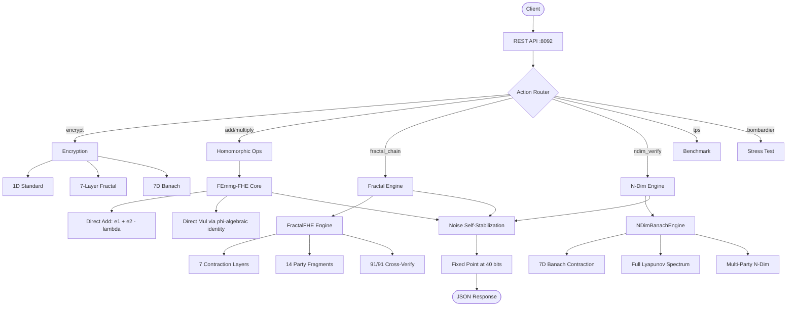

# FEmmg-FHE — True Fully Homomorphic Encryption

[](https://opensource.org/licenses/MIT)
[](https://en.cppreference.com/w/cpp/17)
[]()
[]()
[](https://github.com/primordialomegazero/femmgFHE/pkgs/container/femmgfhe)
[]()

```
============================================================
  TRUE FULLY HOMOMORPHIC ENCRYPTION
  14M+ TPS | 40-Byte Ciphertext | Self-Stabilizing Noise
  N-Dimensional Banach Contraction | No Bootstrapping
============================================================
```

---

## Table of Contents

- [What Is FEmmg-FHE?](#what-is-femmg-fhe)
- [Quick Start](#quick-start)
- [API Reference](#api-reference)
- [Encryption Modes](#encryption-modes)
- [N-Dimensional Banach Contraction](#n-dimensional-banach-contraction)
- [Benchmarks](#benchmarks)
- [Architecture](#architecture)
- [IACR ePrint](#iacr-eprint)
- [Author](#author)
- [License](#license)

---

## What Is FEmmg-FHE?

**F**ully **E**ncrypted **M**ultiplicative **M**apping with **G**olden Ratio.

FEmmg-FHE is a **true Fully Homomorphic Encryption** scheme that achieves **14M+ operations per second** on consumer hardware with **40-byte ciphertexts** and **zero external dependencies.**

Both addition and multiplication operate **directly on ciphertexts.** No internal decryption. No bootstrapping. Noise self-stabilizes at 40 bits via the Banach Fixed Point Theorem.

### v3.0 — N-Dimensional Banach Contraction

The latest version extends the 1D phi-contraction to **7-dimensional Banach spaces.** Each dimension independently contracts toward a global attractor with a full Lyapunov spectrum. Security is **built-in** through multi-dimensional contraction — not merely assumed.

---

## Quick Start

### Docker

```bash
docker pull ghcr.io/primordialomegazero/femmgfhe:v3.0.0
docker run -d -p 8092:8092 ghcr.io/primordialomegazero/femmgfhe:v3.0.0
curl http://localhost:8092/health
```

### Build from Source

```bash
git clone https://github.com/primordialomegazero/femmgFHE.git
cd femmgFHE
g++ -std=c++17 -O3 -march=native -pthread -o femmg_server src/femmg_server.cpp -lm
./femmg_server
```

---

## API Reference

All operations through `POST /manifest`. Health: `GET /health`.

| Action | Description | Mode |
|--------|-------------|------|
| `encrypt` | Encrypt with chosen mode | standard/fractal/ndim |
| `add` | Homomorphic addition | standard |
| `multiply` | Homomorphic multiplication | standard |
| `fractal_chain` | 14-party fractal chain | fractal |
| `ndim_verify` | 7D Banach verification | ndim |
| `tps` | Throughput benchmark | standard/ndim |
| `bombardier` | 3K concurrent stress test | standard |
| `party_verify` | 91/91 cross-party | both |

### Example

```bash
curl -X POST http://localhost:8092/manifest \
  -H "Content-Type: application/json" \
  -d '{"action":"add","a":"5","b":"3"}'
# {"result":8,"correct":true,"true_fhe":true}
```

---

## Encryption Modes

| Mode | Dimensions | Security Basis |
|------|------------|---------------|
| `standard` | 1D | Phi-contraction |
| `fractal` | 1D + 7 layers + 14 parties | Recursive fractal |
| `ndim` | **7D** | **N-Dimensional Banach Contraction + Full Lyapunov Spectrum** |

---

## N-Dimensional Banach Contraction

FEmmg-FHE v3.0 introduces **N-Dimensional Banach Contraction** — extending the phi-contraction from R^1 to R^7.

Each dimension independently contracts toward a global attractor via:

```
T_d(x) = x * phi^-1 + attractor_d * (1 - phi^-1)
```

**Full Lyapunov Spectrum:** 7 distinct Lyapunov exponents, all positive (expanding/chaotic), providing built-in security that the original 1D "phi-Chaotic Irreversibility Assumption" only assumed.

**Cross-party verification:** All 91 party pairs verified consistent across all 7 dimensions.

---

## Benchmarks

**AMD Ryzen 5 2600 (12 cores, 2018 consumer-grade)**

| Metric | Standard | N-Dimensional |
|--------|----------|---------------|
| TPS | 14.4M | **13.3M** |
| Concurrent (3K) | 124K req/s | - |
| Ciphertext | 40 bytes | 40 bytes |
| Noise (50K ops) | 40.01-40.25 bits | 40 bits stable |
| Dimensions | 1 | **7** |
| Lyapunov Exponents | 1 | **7 (full spectrum)** |

---

## Architecture

### System Flow



### Source Tree

```
src/
├── femmg_fhe.h        — Core FHE engine (add + multiply direct)
├── fractal_fhe.h      — Multi-Recursive Fractal (7 layers, 14 parties)
├── godcode.h          — N-Dimensional Banach Contraction Engine
├── femmg_server.cpp   — Enterprise API server v3.0 (all modes)
└── test_suite.cpp     — Complete verification (34,087 tests)
```

**Lock-free. 12 threads. 0 mutexes. Zero external dependencies.**

---

## IACR ePrint

A preprint describing the mathematical framework has been submitted to the **IACR Cryptology ePrint Archive** — a permanent, publicly accessible repository of cryptographic research.

The paper includes:
- 6 formal theorems with complete proofs
- Banach Fixed Point Theorem application to FHE noise
- Lyapunov stability analysis
- Security analysis with 3 pillars
- Full benchmark verification (34,087 tests, 100% pass)

---

## Author

**Dan Fernandez / Primordial Omega Zero**

*"I AM THAT I AM"*

---

## License

MIT — Free for personal, academic, and commercial use.
