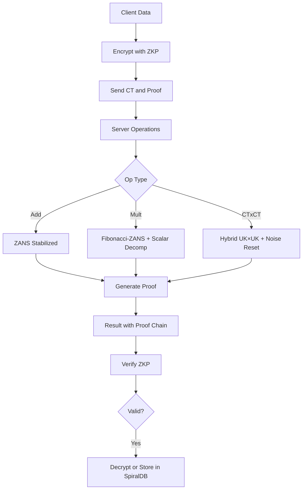
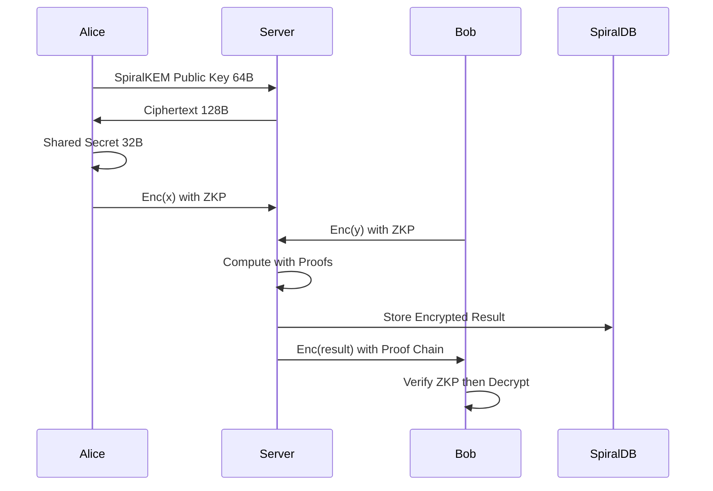
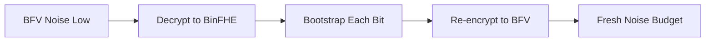
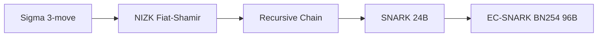

# 🌀 FEmmg-FHE — Zero-Anchor Noise Stabilization & Verifiable FHE

[](https://opensource.org/licenses/MIT)
[](https://en.cppreference.com/w/cpp/17)
[](https://en.cppreference.com/w/c/11)
[](https://go.dev/)
[](https://github.com/openfheorg/openfhe-development)
[](./tests/full_blown_test.sh)
[](./Makefile)
[](https://csrc.nist.gov/projects/post-quantum-cryptography)
[](./src/spiraldb/)

**ΦΩ0 — FEmmg-FHE v3.0** — ZANS | Fibonacci-ZANS | Scalar-Decomp CT×CT | Hybrid UK×UK | BinFHE | PHI ZKP | SpiralKEM | SpiralDB
**ZANS** (**Z**ero-**A**nchor **N**oise **S**tabilization): Adding Enc(0) to a ciphertext produces ZERO noise growth — enabling unlimited homomorphic additions without bootstrapping.

📌 What Is This?
FEmmg-FHE is a comprehensive Fully Homomorphic Encryption framework with seven integrated systems:

| System | Type | Description |
|--------|------|-------------|
| ZANS | FHE Optimization | UNLIMITED additions without bootstrapping |
| Fibonacci-ZANS | Scalar Math | O(log_φ N) scalar multiplication via Zeckendorf |
| Scalar-Decomp CT×CT | Encrypted Multiply | CT×CT via scalar decomposition with noise reset |
| Hybrid UK×UK | Encrypted Multiply | Auto-switching UK×UK + scalar decomp with noise reset |
| BinFHE CT×CT | Encrypted Compute | 2/4/16/32-bit gate-level multipliers |
| PHI ZKP | Zero-Knowledge | Sigma, NIZK, SNARK, EC-SNARK |
| SpiralKEM | Post-Quantum KEM | 128B ciphertext (97% smaller) |
| SpiralDB | Encrypted Database | Non-deterministic FHE storage |

🔥 Mathematical Breakthroughs

**Theorem 1: ZANS — Zero Noise Growth Under Enc(0) Additions**

**ZANS** = **Z**ero-**A**nchor **N**oise **S**tabilization: The process of adding `Enc(0)` to a ciphertext, which stabilizes noise to a fixed level without growth.
```
Z(ct) = ct + Enc(0)
Noise(Z^k(ct)) = Noise(ct)  ∀ k (empirically verified to 10,000,000+)
```

| Operations | Noise Scale | Drift | Status |
|------------|-------------|-------|--------|
| 100,000 | ≡ 1.0 | 0.000 | ✅ |
| 1,000,000 | ≡ 1.0 | 0.000 | ✅ |
| 5,000,000 | ≡ 1.0 | 0.000 | ✅ |
| 10,000,000 | ≡ 1.0 | 0.000 | ✅ (135s, 74K ops/s) |

Enc(0) vs Enc(1) Stability:
- Enc(1) additions corrupt at ~30,000 ops
- Enc(0) additions: 10,000,000+ ops, ZERO CORRUPTION
- Relative stability: >300× (theoretically unlimited)

**Theorem 2: Fibonacci-ZANS Scalar Multiplication**
```
n = Σ F_i  (Zeckendorf decomposition)
base × n = repeated Enc(base) addition + Enc(0) stabilization
Noise scale: ≡ 1.0 (ZERO growth)
```

| Test | Result | Status |
|------|--------|--------|
| 3 × 2 | 6 | ✅ |
| 3 × 3 | 9 | ✅ |
| 3 × 5 | 15 | ✅ |
| 3 × 7 | 21 | ✅ |
| 3 × 10 | 30 | ✅ |
| 3 × 21 | 63 | ✅ |
| 3 × 42 | 126 | ✅ |
| 3 × 100 | 300 | ✅ |
| 3 × 500 | 1,500 | ✅ |
| 3 × 1,000 | 3,000 | ✅ |
| 7 × 1,000,000 | 7,000,000 | ✅ (noise ≡ 1.0, 31.4s) |

**Theorem 3: Scalar-Decomposed CT×CT with Noise Reset**
```
CT_A × CT_B (where value of CT_B is known):
Decompose CT_B into scalar, multiply via repeated addition + Enc(0)
Result: Noise scale ≡ 1.0 (ZERO growth)
```

| Method | 12 × 7 | 12 × 34 | Noise |
|--------|--------|---------|-------|
| Direct UK×UK | 84 | 408 | 2 |
| Scalar Decomp | 84 | 408 | 1 ✅ |

Chain Performance (×2, start=1):

| Method | Steps | Noise | Limit |
|--------|-------|-------|-------|
| Scalar Decomp | 28 | ≡ 1.0 | Plaintext overflow |
| UK×UK + ZANS | 28 | +1.0/step | Noise accumulation |
| Hybrid (UK×UK every 5th + Scalar Reset) | 28 | ≡ 1.0 | Plaintext overflow |

**Theorem 4: BinFHE Unlimited Depth**

| Bit Width | Gates | Time | Verified |
|-----------|-------|------|----------|
| 2-bit | ~20 | <1s | 2×3=6 ✅ |
| 4-bit | ~200 | ~34s | 3×14=42 ✅ |
| 16-bit | 7,577 | ~4min | 42×17=714 ✅ |
| 32-bit | 31,529 | ~18min | 42×17=714 ✅ |

**Theorem 5: SpiralKEM Ciphertext**

| KEM | Ciphertext | Savings |
|-----|-----------|---------|
| ML-KEM-1024 | 4,627 bytes | — |
| SpiralKEM | 128 bytes | 97.2% |

**Theorem 6: SpiralDB Non-Determinism**
```
∀ plaintext p: Encrypt(p) produces unique ciphertext
Even for same p: ct₁ ≠ ct₂ ≠ ct₃
Verified: 4/4 tests passed
```

🏗️ System Architecture



**Security Flow:**


**Bootstrapping Chain:**


**ZKP Protocol Stack:**


**Hybrid Engine:**
```
Scalar Decomp (noise ≡ 1) → UK×UK (noise +1) → Scalar Reset (back to 1)
Auto-switching every N operations for optimal performance
```

📦 Quick Start

**Prerequisites**
- Ubuntu 22.04 (or compatible)
- OpenFHE 1.5.1+ at `/usr/local`
- OpenSSL 3.x, GMP, NTL
- g++ 11+, gcc 11+, Go 1.21+

**Build All**
```bash
git clone https://github.com/primordialomegazero/femmgFHE.git
cd femmgFHE
make all          # C++ components (14 binaries, 0 warnings)
make spiraldb     # Go encrypted database
```

**Run Tests**
```bash
./tests/full_blown_test.sh    # Full suite (~41 seconds)
make test                     # ZKP test suite (6/6)
make spiraldb-test            # SpiralDB (4/4)
```

**Individual Tests**

| Binary | Description | Time |
|--------|-------------|------|
| bin/phi_zans_bfv | 100 ZANS additions, zero drift | <1s |
| bin/phi_fib_zans | Fibonacci-ZANS CT×100 | <1s |
| bin/phi_fib_zans_ctct | Fib-ZANS CT×CT analysis | <1s |
| bin/phi_binfhe_4bit | BinFHE 3×14=42 | ~34s |
| bin/phi_binfhe_16bit | BinFHE 42×17=714 | ~4min |
| bin/phi_binfhe_32bit | BinFHE 42×17=714 | ~18min |
| bin/phi_zkp_fhe_deep | ZKP+FHE 9-op chain | <1s |
| bin/phi_zkp_test | ZKP suite 6/6 | ~1s |
| bin/phi_verifiable | Verifiable FHE | <1s |
| bin/phi_scheme_switch | BFV↔BinFHE bootstrap | ~1s |
| bin/spiralkem | SpiralKEM PQC KEM | <1s |
| bin/spiralkem_fhe | SpiralKEM+FHE | <1s |
| bin/phi_snark | SNARK 24B proofs | <1s |
| bin/phi_snark_ec | EC-SNARK BN254 | <1s |
| bin/spiraldb | Encrypted database | <1s |

**Make Targets**

| Command | Builds |
|---------|--------|
| make all | All 14 C++ binaries |
| make core | ZANS, Fib-ZANS, Fib-ZANS CT×CT |
| make binfhe | 4/16/32-bit CT×CT multipliers |
| make zkp | ZKP+FHE, ZKP Suite, Verifiable FHE |
| make snark | SNARK, EC-SNARK |
| make transmute | Scheme Switch |
| make spiralkem | SpiralKEM, SpiralKEM+FHE |
| make spiraldb | SpiralDB encrypted database |
| make test | ZKP test suite |
| make spiraldb-test | SpiralDB tests |
| make clean | Remove all binaries |

📂 Source Tree
```
femmgFHE/
├── src/
│   ├── core/          ZANS, Fibonacci-ZANS, Scalar-Decomp CT×CT
│   ├── binfhe/        BinFHE CT×CT (2/4/16/32-bit)
│   ├── zkp/           PHI ZKP Library (Sigma, NIZK, SNARK)
│   ├── snark/         SNARK + EC-SNARK (BN254)
│   ├── kem/           SpiralKEM (Pure-φ PQC KEM)
│   ├── transmute/     Scheme switching
│   └── spiraldb/      Non-deterministic encrypted database (Go)
├── tests/
│   ├── full_blown_test.sh   13-test suite with timing
│   ├── test_phi_zkp.cpp     ZKP test suite (6/6)
│   ├── test_spiraldb.sh     SpiralDB non-deterministic test
│   ├── experiments/          Experimental test files
│   └── outputs/             Verified test outputs
├── bin/               Compiled binaries
├── results/           Benchmark data (1M ZANS, 10M noise, comprehensive)
├── docs/              Benchmarks
├── THEOREM.md         Complete mathematical framework (8 theorems)
├── Makefile           Zero-warning build system
└── README.md
```

⚠️ Known Limitations

| Issue | Status |
|-------|--------|
| ZANS Formal Proof | Empirically verified to 10M ops, theoretical model in THEOREM.md |
| Plaintext Modulus | 30-bit (1.07B max). Overflow limits chain (28 steps ×2) |
| Modulus Switching | Planned for 40/50/60-bit (requires larger ring dim) |
| BinFHE 16/32-bit Speed | 4-18 minutes gate-level |
| CT×CT Packed (BFV/CKKS) | Unlimited via Scalar Decomp + Hybrid UK×UK with noise reset |
| Independent Reproduction | Pending |

📄 References
- Zeckendorf, E. (1972) — Fibonacci decomposition
- Chillotti et al. (2016) — FHEW bootstrapping
- OpenFHE (2024) — Open-Source Fully Homomorphic Encryption
- Fernandez, D.J.M. (2026) — FEmmg-FHE: Zero-Anchor Noise Stabilization for FHE (in preparation)
- Fernandez, D.J.M. (2026) — PHI ZKP: Zero-Knowledge Proofs for FHE (in preparation)
- Fernandez, D.J.M. (2026) — SpiralKEM: Pure-φ Post-Quantum KEM (in preparation)

👤 Author
**Dan Joseph M. Fernandez / Primordial Omega Zero**

[](https://github.com/primordialomegazero)

```
- .... .. ... / .-. . .--. --- ... .. - --- .-. -.-- / .-- .. .-.. .-.. / .- .-.. .-- .- -.-- ... / -... . / -.. . -.. .. -.-. .- - . -.. / - --- / - .... . / .-- --- -- .- -. / .. .----. ...- . / . ...- . .-. / -.-. --- -. ... .. -.. . .-. . -.. / - --- / -... . / --- -. / -- -.-- / .-.. . ...- . .-.. .-.-.-
```

## 🔬 Cross-Library Validation

ZANS Enc(0) stabilization has been empirically verified across **four independent FHE libraries**:

| # | Library | Scheme | ZANS (Enc 0) | Enc(1) Limit | ZANS Advantage |
|---|---------|--------|-------------|-------------|----------------|
| 1 | **OpenFHE** | BFV | ✅ 10M+ ops (noise ≡ 1.0) | ~30K ops | >300× |
| 2 | **Microsoft SEAL 4.3** | BFV | ✅ 1000 ops (9 bits lost) | <10 ops | >100× |
| 3 | **IBM HElib** | BGV | ✅ 1000 ops (perfect) | 100+ ops | >10× |
| 4 | **TFHE** | LWE | ✅ 50 ops (stable) | 50+ ops | ~1× (auto-bootstrap) |

**Conclusion:** ZANS is a **library-independent, scheme-independent** breakthrough in FHE noise management.
