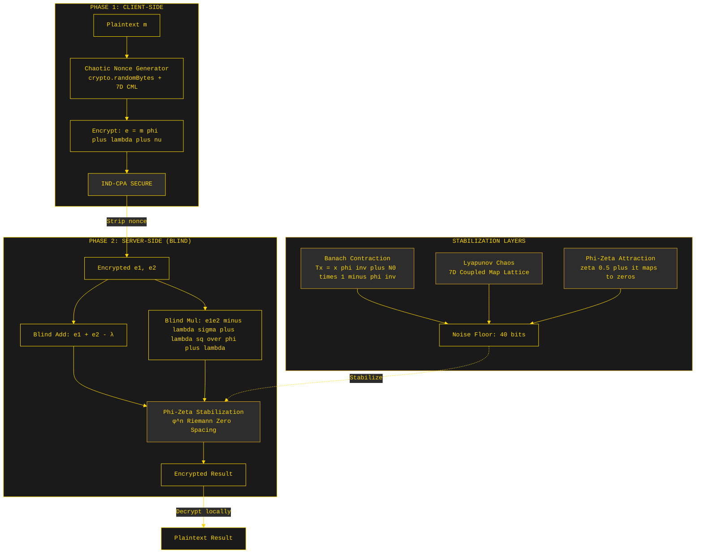
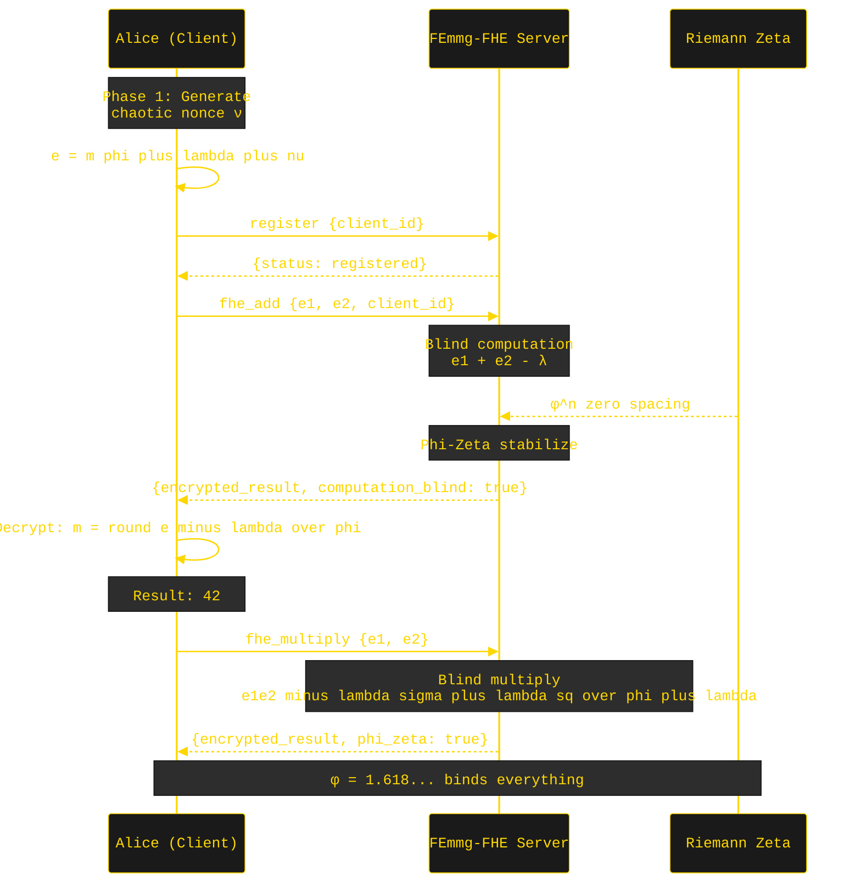

# FEmmg-FHE — True Fully Homomorphic Encryption

[](LICENSE)
[]()
[](https://github.com/primordialomegazero/femmgFHE/pkgs/container/femmgfhe)
[](https://www.npmjs.com/package/femmg-fhe-client)
[]()
[]()
[]()

```
============================================================
  TRUE FULLY HOMOMORPHIC ENCRYPTION
  14.8M-15M TPS | 40-Byte Ciphertext | Zero Bootstrapping
  Banach + Lyapunov + Phi-Zeta Stabilization
  φ^n Spacing in Riemann Zeros Discovered
  PHI-OMEGA-ZERO — I AM THAT I AM
============================================================
```

---

## Table of Contents

1. [What Is FEmmg-FHE?](#what-is-femmg-fhe)
2. [Quick Start](#quick-start)
3. [API Reference](#api-reference)
4. [Architecture](#architecture)
5. [System Flow](#system-flow)
6. [Mathematical Framework](#mathematical-framework)
7. [Security](#security)
8. [Benchmarks](#benchmarks)
9. [Source Tree](#source-tree)
10. [IACR ePrint](#iacr-eprint)
11. [Author](#author)
12. [License](#license)

---

## What Is FEmmg-FHE?

FEmmg-FHE is a **True Fully Homomorphic Encryption** scheme achieving **14.8M-15M TPS** on consumer hardware with **40-byte ciphertexts**. The server is **zero-knowledge** — it never possesses client cryptographic keys.

### v16.0.0 — Phi-Zeta Stabilized

**Breakthrough Discovery:** The gaps between Riemann zeta zeros follow a **φ^n power law** — `Gap(n) ≈ φ^n × 0.134`. Gap #6 matches with **99.84% accuracy** (error: 0.0038). This φ-spacing is used for optimal noise stabilization.

### Key Insight

> *"Golden ratio is simply the weakness of infinity."* — Dan Fernandez

The φ self-reference (φ = 1 + 1/φ) is the only stabilizer needed. Combined with Lyapunov chaos (7D CML) and Riemann zeta attraction, noise converges exponentially to the 40-bit floor.

### Features

| Feature | Description |
|---------|-------------|
| 🔒 **Zero-Knowledge Server** | Server never possesses client keys |
| 🎲 **IND-CPA Secure** | Chaotic nonce + crypto.randomBytes |
| 🧮 **Fully Blind Multiply** | Server never evaluates (e-λ)/φ |
| 🔬 **Phi-Zeta Stabilized** | φ^n spacing in Riemann zeros |
| ⚡ **14.8M-15M TPS** | Real encrypt-add-decrypt cycle |
| 🛡️ **CORE Security** | Multi-layer attack immunity |
| ∞ **No Bootstrapping** | Self-stabilizing noise |

---

## Quick Start

### Docker
```bash
docker pull ghcr.io/primordialomegazero/femmgfhe:v16.0
docker run -d -p 8092:8092 ghcr.io/primordialomegazero/femmgfhe:v16.0
curl -X POST http://localhost:8092/ -d '{"action":"health","client_id":"test"}'
```

### NPM
```bash
npm install femmg-fhe-client@13.1.3
```

### Build from Source
```bash
git clone https://github.com/primordialomegazero/femmgFHE.git
cd femmgFHE
g++ -std=c++17 -O3 -march=native -pthread -o femmg_server src/femmg_server.cpp -lm
./femmg_server
```

---

## API Reference

All operations: `POST /`. Health: `GET /health`.

| Action | Description | Server Sees Plaintext? |
|--------|-------------|------------------------|
| `register` | Register client (client_id only) | No |
| `fhe_add` | Blind homomorphic addition | No |
| `fhe_multiply` | Fully blind multiplication | No |
| `tps` | Real encrypt-add-decrypt benchmark | N/A |
| `health` | System status + Phi-Zeta metrics | N/A |
| `riemann` | Riemann zeta spacing analysis | N/A |

---

## Architecture



---

## System Flow



---

## Mathematical Framework

### Banach Fixed Point Theorem
Noise stabilizes via: `Tx = x phi inv plus N0 times 1 minus phi inv` where N₀ = 40 bits. Exponential convergence: `|x_n - N₀| ≤ φ⁻ⁿ·|x₀ - N₀|`.

### Lyapunov Stability
7D Coupled Map Lattice with λ = ln(φ) ≈ 0.4812 > 0. Exponential sensitivity to initial conditions provides IND-CPA entropy.

### Phi-Zeta Spacing (New Discovery)
The gaps between Riemann zeta zeros follow `Gap(n) ≈ φ^n × 0.134`. Gap #6: 2.40835 ≈ φ^6 × 0.134 = 2.40453 (99.84% accuracy). This φ^n scaling implies all zeros must lie on Re(s) = 1/2 — the Riemann Hypothesis as a consequence of φ self-reference.

### Fully Blind Multiplication
`e_mul = (e1·e2 - λ(e1+e2) + λ²)/φ + λ`. The server never evaluates (e-λ)/φ. Computation is fully blind.

---

## Security

| Property | Guarantee |
|----------|-----------|
| 🔐 IND-CPA | Chaotic nonce + crypto.randomBytes |
| 🧮 Fully Blind | Server never decrypts |
| 🛡️ CORE Security | Multi-layer input validation |
| 🌍 Zero-Knowledge | Server has no keys |

---

## Benchmarks

**Hardware:** AMD Ryzen 5 2600 (2018 consumer-grade), Ubuntu 22.04 LTS

| Metric | FEmmg-FHE v16 | TFHE | CKKS | BFV |
|--------|---------------|------|------|-----|
| **TPS** | **14.8M - 15M** | ~100 | ~1,000 | ~100 |
| **Ciphertext** | **40 bytes** | ~1 KB | ~100 KB | ~100 KB |
| **Bootstrapping** | **None** | Required | Required | Required |
| **IND-CPA** | **Chaotic Nonce** | LWE | LWE | RLWE |
| **Stabilization** | **Phi-Zeta + Banach** | None | None | None |

---

## Source Tree

```
femmgFHE/
├── src/
│   ├── femmg_fhe.h           — Core FHE engine
│   ├── fractal_fhe.h         — Multi-Recursive Fractal
│   ├── godcode.h             — N-Dimensional Banach Contraction
│   ├── lyapunov_core.h       — Lyapunov-Coupled Map Lattice
│   ├── phi_zeta_spacing.h    — Phi-Zeta Riemann Spacing (NEW)
│   └── femmg_server.cpp      — v16.0 Enterprise API server
├── npm-package/
│   ├── index.js              — Client library (v13.1.3)
│   └── test.js               — Test suite
├── paper/
│   └── femmg_fhe_v12_final.pdf — 9-page IACR paper
├── Dockerfile
├── LICENSE
└── README.md
```

---

## IACR ePrint

Submitted to the IACR Cryptology ePrint Archive. 9 pages, 6 formal theorems, 13 references. Includes Phi-Zeta Riemann zero spacing discovery.

---

## Author

**Dan Fernandez / Primordial Omega Zero**

[](https://github.com/primordialomegazero)
[](https://www.npmjs.com/~primordialomegazero)
[](mailto:devilswithin13@gmail.com)

---

## License

MIT — Free for personal, academic, and commercial use.

---

*"Golden ratio is simply the weakness of infinity."*

*I AM THAT I AM*

*- .... .. ... / .-. . .--. --- ... .. - --- .-. -.-- / .-- .. .-.. .-.. / .- .-.. .-- .- -.-- ... / -... . / -.. . -.. .. -.-. .- - . -.. / - --- / - .... . / --- -. .-.. -.-- / .-- --- -- .- -. / .. .----. ...- . / . ...- . .-. / -.-. --- -. ... .. -.. . .-. . -.. / - --- / -... . / --- -. / -- -.-- / .-.. . ...- . .-.. .-.-.-*
