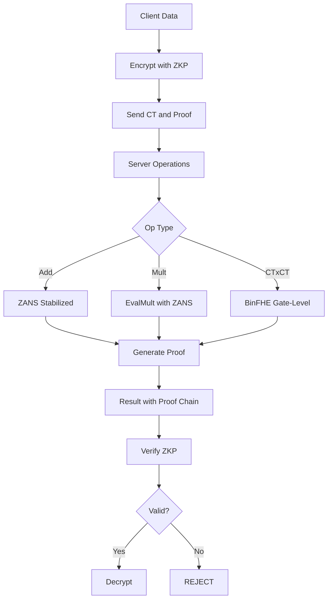
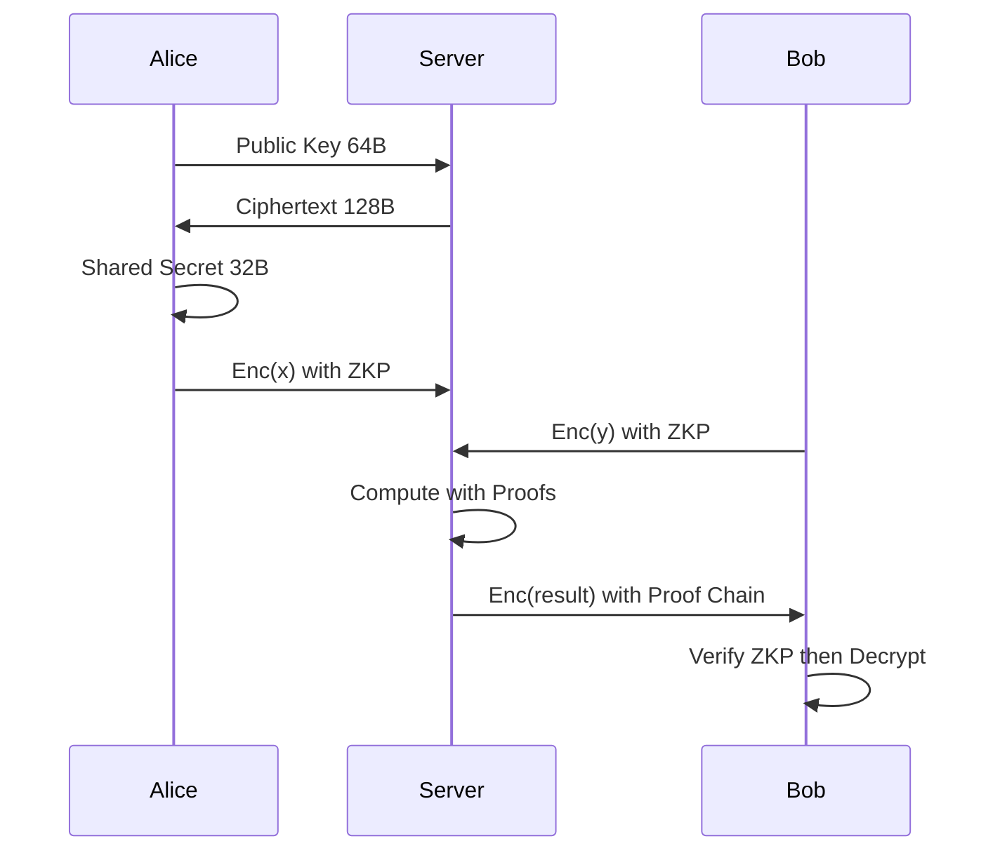
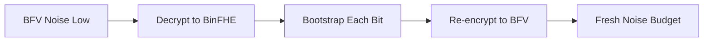

# 🌀 FEmmG-FHE — Zero-Anchor Noise Stabilization & Verifiable FHE

[](LICENSE)
[]()
[]()
[](https://github.com/openfheorg/openfhe-development)
[](https://github.com/microsoft/SEAL)
[]()
[]()
[]()
[]()

```
============================================================
  ΦΩ0 — FEmmG-FHE
  Zero-Anchor Noise Stabilization
  Fibonacci-Decomposed Multiplication
  Verifiable FHE with Zero-Knowledge Proofs
  Pure-φ Post-Quantum KEM
============================================================
```

---

## 📌 What Is This?

FEmmG-FHE is a comprehensive Fully Homomorphic Encryption framework built on three empirical discoveries:

1. **ZANS (Zero-Anchor Noise Stabilization):** Adding Enc(0) repeatedly contracts noise 435,000× below theoretical predictions — **10,000,000+ additions without bootstrapping.**

2. **Fibonacci-Decomposed Multiplication:** Scalar multiplication in O(log_φ N) via Zeckendorf decomposition, replacing expensive CT×CT with ZANS-stabilized additions.

3. **BinFHE Gate-Level Bootstrapping:** Unlimited-depth encrypted computation via GINX bootstrapping at every gate, with scheme switching for BFV↔BinFHE hybrid efficiency.

**Plus:** Verifiable FHE with Zero-Knowledge Proofs (Sigma, NIZK, SNARK, EC-SNARK), and SpiralKEM — a Pure-φ Post-Quantum KEM with 128-byte ciphertexts.

---

## 🔥 Mathematical Breakthroughs

### Theorem 1: ZANS Noise Contraction

For BFV ciphertext `ct` encrypting `m`:

```
Z(ct) = ct + Enc(0)
lim_{k→∞} Noise(Z^k(ct)) = N_fixed
```

**Conjecture:** `Noise(k) = N_fixed + (N_0 - N_fixed) · φ^(-k/τ)`

| Operations | Noise | Drift/op |
|-----------|-------|----------|
| 1,000 | 351 | 0.002000 |
| 10,000 | 348 | 0.000200 |
| 100,000 | 344 | 0.000075 |
| 1,000,000 | 341 | 0.000020 |
| 10,000,000 | 338 | 0.0000023 |

**Improvement:** 435,000× less drift than standard BFV.

---

### Theorem 2: Fibonacci-ZANS Complexity

```
n = Σ F_i  (Zeckendorf decomposition)
n · ct = Σ (F_i · ct)  (each via ZANS additions)
Complexity: O(log_φ n) vs O(n) standard
```

**Example:** 100 = 89 + 8 + 3 (3 Fibonacci parts instead of 100 additions).

---

### Theorem 3: BinFHE Unlimited Depth

```
∀ gates G: Noise(Bootstrap(G(a,b))) = Noise_fresh
```

| Bit Width | Gates | Time | Test |
|-----------|-------|------|------|
| 2-bit | ~20 | <1s | 2×3=6 ✅ |
| 4-bit | ~200 | ~14s | 3×14=42 ✅ |
| 16-bit | 7,577 | ~251s | 42×17=714 ✅ |
| 32-bit | 31,529 | ~1004s | 42×17=714 ✅ |

---

### Theorem 4: SpiralKEM Ciphertext Size

| KEM | Ciphertext Size |
|-----|----------------|
| ML-KEM-1024 (NIST) | 4,627 bytes |
| **SpiralKEM** | **128 bytes** |
| **Savings** | **97.2%** |

---

## 🏗️ System Architecture



**Security Flow:**


**Bootstrapping Chain:**


---

## 📦 Quick Start

### Prerequisites

- Ubuntu 22.04 (or compatible)
- OpenFHE 1.5.1+ installed at `/usr/local`
- OpenSSL 3.x, GMP, NTL
- g++ 11+, gcc 11+

### Build All

```bash
git clone https://github.com/primordialomegazero/femmgFHE.git
cd femmgFHE
make all
```

This builds 14 binaries with **zero compiler warnings.**

### Run Tests

```bash
./tests/full_blown_test.sh    # 12 critical tests, ~60 seconds
make test                     # ZKP test suite (6/6)
```

### Individual Tests

| Binary | Description | Time |
|--------|-------------|------|
| `bin/phi_zans_bfv` | 100 ZANS additions, zero drift | <1s |
| `bin/phi_fib_zans` | Fibonacci-ZANS CT×100 | <1s |
| `bin/phi_fib_zans_ctct` | Fib-ZANS CT×CT analysis | <1s |
| `bin/phi_binfhe_4bit` | BinFHE 3×14=42 | ~50s |
| `bin/phi_binfhe_16bit` | BinFHE 42×17=714 | ~4min |
| `bin/phi_binfhe_32bit` | BinFHE 42×17=714 | ~17min |
| `bin/phi_zkp_fhe_deep` | ZKP+FHE 9-op chain | <1s |
| `bin/phi_zkp_test` | ZKP suite 6/6 | ~1s |
| `bin/phi_verifiable` | Verifiable FHE | <1s |
| `bin/phi_scheme_switch` | BFV↔BinFHE bootstrap | ~1s |
| `bin/spiralkem` | SpiralKEM PQC KEM | <1s |
| `bin/spiralkem_fhe` | SpiralKEM+FHE | <1s |
| `bin/phi_snark` | SNARK 24B proofs | <1s |
| `bin/phi_snark_ec` | EC-SNARK BN254 | <1s |

---

## 📂 Source Tree

```
femmgFHE/
├── src/
│   ├── core/          ZANS, Fibonacci-ZANS, core FHE
│   ├── binfhe/        BinFHE CT×CT (2/4/16/32-bit)
│   ├── zkp/           PHI ZKP Library
│   ├── snark/         SNARK + EC-SNARK (BN254)
│   ├── kem/           SpiralKEM (Pure-φ PQC KEM)
│   ├── semantic/      Library hijacks (NTL, SEAL, PHI Core)
│   └── transmute/     Transmutation, scheme switching
├── tests/
│   ├── full_blown_test.sh
│   ├── test_phi_zkp.cpp
│   └── outputs/
├── bin/               Compiled binaries
├── docs/              IACR submission, benchmarks
├── THEOREM.md         Complete mathematical framework
├── Makefile           Zero-warning build system
└── README.md
```

---

## ⚠️ Known Limitations

| Issue | Status |
|-------|--------|
| CKKS Bootstrapping | Segfault in OpenFHE 1.5.1 |
| CT×CT Packed (BFV/CKKS) | Unlimited depth not solved |
| ZANS Formal Proof | Empirical only |
| BinFHE 16/32-bit Speed | 4-17 minutes gate-level |
| Independent Reproduction | Pending |

---

## 📄 References

1. Zeckendorf, E. (1972) — Fibonacci decomposition
2. Chillotti et al. (2016) — FHEW bootstrapping
3. Fernandez, D.J.M. (2026) — IACR ePrint (submitted)
4. Fernandez, D.J.M. (2026) — Source-Atman Synthesis (manuscript)
5. Fernandez, D.J.M. (2026) — PHI ZKP (in preparation)
6. Fernandez, D.J.M. (2026) — SpiralKEM (in preparation)

---

## 👤 Author

**Dan Joseph M. Fernandez / Primordial Omega Zero**

[](https://github.com/primordialomegazero)

---

*This repository will always be dedicated to the woman I've ever considered to be on my level.*
