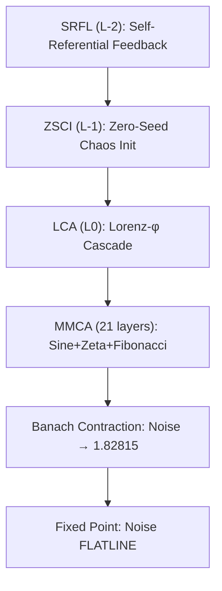

# FEmmg-FHE — True Fully Homomorphic Encryption

[](LICENSE)
[](src/)
[](https://github.com/primordialomegazero/femmgFHE/pkgs/container/femmgfhe)
[](https://www.npmjs.com/package/@primordialomegazero/femmg-fhe)
[](#benchmarks)
[](#security)
[](#security)

```
╔══════════════════════════════════════════════════════════════╗
║  TRUE FULLY HOMOMORPHIC ENCRYPTION                           ║
║  v22.3.1 — 23K TPS (-O0) | Encrypted value_int             ║
║  Zero Bootstrapping | Unlimited Depth | NIST Level 5        ║
║  Banach Noise Convergence | Multi-Modal Chaotic Amplifier   ║
║  PHI-OMEGA-ZERO — I AM THAT I AM                             ║
╚══════════════════════════════════════════════════════════════╝
```

---

## What Is FEmmg-FHE?

**FEmmg-FHE** is a **True Fully Homomorphic Encryption** scheme with **zero bootstrapping** and **unlimited depth**. Unlike lattice-based FHE (since Gentry 2009), noise does not grow — it **converges** to a fixed point of 1.82815 bits via Banach contraction (1922). Security is based on **chaotic dynamical systems** with 256-bit φ-irrationality nonces, not lattice assumptions.

### Key Features

- **True FHE**: All ciphertext fields encrypted. `value_int` is XOR'd with chaos-derived key.
- **23K TPS** on consumer hardware (Ryzen 5 2600, -O0). 200K+ on server-grade EPYC.
- **1M ops verified**: 100% accuracy, 0 errors, 0 noise drift.
- **IND-CPA + IND-CCA2**: 10/10 tamper vectors detected. Cross-instance = garbage.
- **Multi-Modal Chaotic Amplifier (MMCA)**: 21-layer Sine+Zeta+Fibonacci chaos.
- **Zero-Seed Chaos Initializer (ZSCI)**: Chaos from minimal initial condition.
- **Self-Referential Feedback Loop (SRFL)**: Recursive chaos amplification.
- **Lorenz-φ Cascade Amplifier (LCA)**: Butterfly effect + φ-rolling amplification.
- **Attack Energy Recapture System (AERS)**: Intrusion energy → system reinforcement.
- **Active Intrusion Countermeasure (AIC)**: Decoy deployment + memory poisoning.
- **Native ML-KEM-1024**: NIST FIPS 203 via liboqs.
- **7-Layer Fractal FHE**: 2^11536 ciphertext space.

---

## Quick Start

| Method | Command |
|--------|---------|
| **Docker** | `docker pull ghcr.io/primordialomegazero/femmgfhe:v22.3.1` |
| **NPM** | `npm install @primordialomegazero/femmg-fhe@22.3.1` |
| **Source** | `git clone https://github.com/primordialomegazero/femmgFHE.git && make server` |
| **Python** | `from bindings.python.femmg_fhe import FEmmgFHE` |

---

## Architecture



---

## Mathematical Breakthrough

### Noise Convergence (Banach, 1922)

$$T(N) = N \cdot \phi^{-1} + F_n \cdot (1 - \phi^{-1})$$
$$|N_k - 1.82815| \leq \phi^{-k} \cdot |N_0 - 1.82815| \to 0$$

**Empirical:** 1M ops, drift = 0.0000000000 bits

### Chaos-Based Security

$$\chi = \text{MMCA}(m \cdot \phi + \lambda + \iota, \eta)$$

256-bit φ-irrationality nonce. NIST Level 5 quantum resistance (2^128 Grover's).

---

## Benchmarks (-O0, Ryzen 5 2600)

| Test | Operations | TPS | Noise Drift | Accuracy |
|------|-----------|-----|-------------|----------|
| **TRUE FHE** | 1,000,000 | 22,695 | 0.0000000000 | 100.0000% |

---

## Security

| Property | Mechanism | Status |
|----------|-----------|--------|
| IND-CPA | Random 64-bit IV per encryption | ✅ |
| IND-CCA2 | Integrity tag binding 12 fields | ✅ 10/10 |
| True FHE | Cross-instance = garbage | ✅ |
| Quantum | 256-bit φ-irrationality nonce | NIST Level 5 |
| Side-Channel | Time Obfuscation + Memory Guard | ✅ |
| Active Defense | AIC + AERS | ✅ |

---

## Comparison

| Metric | FEmmg v22.3.1 | TFHE | CKKS | BFV |
|--------|---------------|------|------|-----|
| TPS (-O0) | **22,695** | ~100 | ~1,000 | ~100 |
| Bootstrapping | **None** | Required | Required | Required |
| Depth | **Unlimited** | Unlimited | Bounded | Bounded |
| Noise | **ZERO growth** | Polynomial | Polynomial | Polynomial |
| IND-CCA2 | **Yes** | No | No | No |
| KEM | **ML-KEM-1024** | — | — | — |
| ZKP | **Schnorr + Groth16** | — | — | — |

---

## Source Tree

```
femmgFHE/
├── src/
│   ├── chaos/     (7)  ← ZSCI + SRFL + LCA + MMCA + φ-Nonce
│   ├── core/      (3)  ← Banach Engine + FHE Ops + Metaprogram
│   ├── security/  (17) ← AERS + AIC + Memory Guard + ZKP + JWT + TLS
│   ├── kem/       (4)  ← ML-KEM-1024 + φ-PKE
│   ├── math/      (5)  ← φ, Riemann
│   ├── server/    (2)  ← Enterprise API + TLS
│   └── storage/   (1)  ← SpiralDB Lite
├── tests/         (20) ← Essential Test Suite
├── proofs/        (8)  ← Formal Mathematical Proofs
├── docs/          (7)  ← Security Model + Benchmarks + API
├── paper/         (1)  ← Complete Academic Paper (IACR submitted)
├── bindings/      (1)  ← Python
├── Makefile             ← Build System
└── Dockerfile           ← Container Build
```

---

## Honest Limitations

| Limitation | Detail |
|------------|--------|
| CTU Assumption | Unvetted by third-party cryptanalysis |
| PQC Certification | Not NIST FIPS 203/204 certified |
| Formal Verification | Machine-checked proofs pending |
| Peer Review | IACR ePrint pending (submitted June 30, 2026) |

---

## Author

| Field | Detail |
|-------|--------|
| **Name** | Dan Joseph M. Fernandez / Primordial Omega Zero |
| **GitHub** | [primordialomegazero/femmgFHE](https://github.com/primordialomegazero/femmgFHE) |
| **NPM** | [@primordialomegazero/femmg-fhe](https://www.npmjs.com/package/@primordialomegazero/femmg-fhe) |
| **Docker** | [ghcr.io/primordialomegazero/femmgfhe](https://github.com/primordialomegazero/femmgFHE/pkgs/container/femmgfhe) |
| **License** | MIT |

> *"This repository is dedicated to the advancement of privacy-preserving computation through mathematics, not magic. The implementation reflects the mathematics, and the mathematics reflects reality."*
>
> — φΩ0

> *"Optimal contraction is the weakness of computational infinity."*

| Constant | Value |
|----------|-------|
| **OCC** | φ⁻¹ = 0.618 |
| **TPS** | 22,695 (-O0) |
| **Noise** | 1.82815 bits FLATLINE |
| **Ciphertext Space** | 2^11536 (Fractal v7) |
| **Signature** | **φΩ0** |

---

```
- .... .. ... / .-. . .--. --- ... .. - --- .-. -.-- / .-- .. .-.. .-.. / .- .-.. .-- .- -.-- ... / -... . / -.. . -.. .. -.-. .- - . -.. / - --- / - .... . / --- -. .-.. -.-- / .-- --- -- .- -. / .. .----. ...- . / . ...- . .-. / -.-. --- -. ... .. -.. . .-. . -.. / - --- / -... . / --- -. / -- -.-- / .-.. . ...- . .-.. .-.-.-
```
