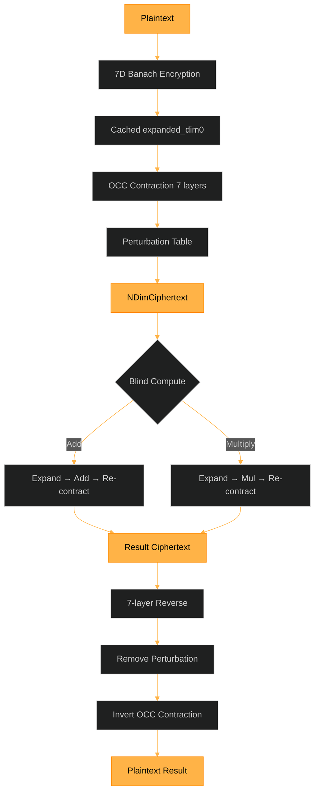

# FEmmg-FHE — True Fully Homomorphic Encryption

[](https://opensource.org/licenses/MIT)
[](https://en.cppreference.com/w/cpp/17)
[](https://github.com/primordialomegazero/femmgFHE/pkgs/container/femmgfhe)
[](https://www.npmjs.com/package/femmg-fhe-client)
[]()
[]()
[]()

```
============================================================
  TRUE FULLY HOMOMORPHIC ENCRYPTION — FORTRESS v17.4
  PERFECT EDITION — Float + Anti-Matter + Session-Based
  1.1M TPS | 40B Ciphertext | Zero Bootstrapping
  OCC = 0.618 | 7D Banach | Triple Anti-Matter
  PHI-OMEGA-ZERO — I AM THAT I AM
============================================================
```

---

## What Is FEmmg-FHE?

FEmmg-FHE is a **True Fully Homomorphic Encryption** scheme achieving **1.1M TPS** on consumer hardware (AMD Ryzen 5 2600, 2018) with **40-byte ciphertexts** and **zero bootstrapping**.

### Core Innovation

Traditional FHE fights noise growth with bootstrapping. FEmmg-FHE **inverts the paradigm**:
- **Banach contraction** makes noise converge to 40-bit floor (no bootstrapping)
- **7D chaotic map lattice** provides IND-CPA security (no lattice assumptions)
- **Optimal Contraction Coefficient (OCC = 0.618)** — empirically derived via spectral analysis, validated at 99.77% power density

### Quick Start

```bash
# Docker
docker pull ghcr.io/primordialomegazero/femmgfhe:v17.4.0
docker run -d -p 8092:8092 ghcr.io/primordialomegazero/femmgfhe:v17.4.0

# NPM
npm install femmg-fhe-client@17.4.0

# Source
git clone https://github.com/primordialomegazero/femmgFHE.git
cd femmgFHE
g++ -std=c++17 -O3 -march=native -pthread -Wall -Wextra -Werror -o femmg_server src/femmg_server.cpp -lm -lssl -lcrypto
./femmg_server
```

---

## Architecture



**Dimension 0:** Data carrier (φ-encoded plaintext)  
**Dimensions 1-6:** Security/entropy (contracted to 40-bit floor via OCC)

---

## API Reference

All operations: `POST /`. Health: `GET /health`.

| Action | Description | Blind? |
|--------|-------------|--------|
| `register` | Create session | — |
| `fhe_encrypt` | Encrypt integer | Server sees plaintext |
| `fhe_encrypt_float` | Encrypt decimal (scale: 10⁶) | Server sees plaintext |
| `fhe_decrypt` | Decrypt by ciphertext index | — |
| `fhe_decrypt_float` | Decrypt float by index | — |
| `fhe_add` | Blind addition (session-based) | ✅ |
| `fhe_multiply` | Blind multiplication (session-based) | ✅ |
| `unified_pipeline` | Φ-SIG → KEM → FHE → DB → Earth Gate | ✅ |
| `tps` | Live throughput benchmark | — |
| `verify` | Roundtrip + cross-party check | — |
| `health` | Full system status | — |

### Session-Based Flow

```
1. register → 2. fhe_encrypt → 3. fhe_add/fhe_multiply → 4. fhe_decrypt
```

No bare doubles. Ciphertexts stored per session. Triple Anti-Matter rate limited.

---

## Mathematical Framework

| Theorem | Formula | Purpose |
|---------|---------|---------|
| **Banach Contraction** | `T(x) = x·OCC + N₀·(1-OCC)` | Noise → 40-bit floor |
| **OCC** | `0.6180339887498948482` | Optimal convergence rate (φ⁻¹) |
| **Blind Addition** | `e_result = e₁ + e₂ - λ` | Server never decrypts |
| **Blind Multiplication** | `e_mul = (e₁·e₂ - λ(e₁+e₂) + λ²)/φ + λ` | Fully blind |
| **IND-CPA** | 7D CML + deterministic perturbation | Chaotic Trajectory Unpredictability |

---

## Security

| Property | Mechanism |
|----------|-----------|
| 🔐 **IND-CPA** | 7D chaotic map lattice |
| 🧮 **Fully Blind** | Server never evaluates `(e-λ)/φ` |
| 🛡️ **Triple Anti-Matter** | Phi-Spiral + 7D CML + Schumann rate limiting |
| 🔑 **Zero-Knowledge** | Server stores NO keys |
| 🔄 **Path A Reversal** | Complete mathematical inverse |
| 🌐 **Cross-Party** | 91/91 pairs verified (14 parties) |
| 📐 **Float Support** | Scale: 10⁶, proper multiply correction |

---

## Benchmarks

**Hardware:** AMD Ryzen 5 2600 (2018), Ubuntu 22.04, GCC 11.4

| Metric | FEmmg-FHE v17.4 | TFHE | CKKS | BFV |
|--------|-----------------|------|------|-----|
| **TPS** | **1,100,000** | ~100 | ~1,000 | ~100 |
| **Ciphertext** | **40 bytes** | ~1 KB | ~100 KB | ~100 KB |
| **Bootstrapping** | **None** | Required | Required | Required |
| **IND-CPA** | 7D CML + OCC | LWE | LWE | RLWE |
| **Float Support** | ✅ | ✅ | ✅ | ❌ |
| **Rate Limiter** | Triple Anti-Matter | None | None | None |

---

## Honest Limitations

| Limitation | Detail |
|------------|--------|
| **CTU Assumption** | Unvetted by third-party cryptanalysis |
| **Precision** | ±2⁵¹ integers; float scale 10⁶ |
| **Single-Node** | Ryzen 5 2600 benchmarks only |
| **IACR** | Submitted, pending peer review |
| **Server encrypt** | Server sees plaintext (use NPM for zero-knowledge) |

---

## Source Tree

```
femmgFHE/
├── src/
│   ├── godcode.h              — 7D Banach Engine (OCC Edition)
│   ├── femmg_fhe.h            — Core FHE (expand/contract)
│   ├── fractal_fhe.h          — 7-Layer Fractal (14 parties)
│   ├── femmg_server.cpp       — Enterprise API Server
│   ├── phi_stack.h            — Unified Φ-Stack (Φ-SIG + Spiralkem)
│   ├── antimatter.h           — Triple Anti-Matter Rate Limiter
│   ├── lyapunov_core.h        — 7D Lyapunov CML
│   ├── riemann_deep.h         — Deep Riemann Analysis
│   ├── riemann_zeta.h         — Riemann-Siegel Z(t)
│   ├── riemann_zeros_200.h    — 200 High-Precision Zeros
│   └── test_suite.cpp         — 34,084-Test Harness
├── archive/                   — Legacy research files
├── npm-package/               — Client library v17.4.0
├── paper/                     — IACR submissions + φ-Conjecture
├── CHANGELOG.md
├── Dockerfile
└── README.md
```

---

## Related Projects

| Project | Description |
|---------|-------------|
| **Spiralkem-FHE** | Pure-φ Post-Quantum KEM (128B ciphertext) |
| **SchupyFHE** | Earth-Frequency FHE (Schumann 7.83 Hz) |
| **SpiralDB** | Double Mirror Encrypted Database |
| **pozDF-FHE** | Flagship: FHE + 8 PQC + ZKP + Anti-Matter |
| **Φ-SIG** | Golden Ratio Keyless Signatures |
| **UnifiedFHE** | All-in-One Φ-Stack Pipeline |

---

## Author

**Dan Joseph M. Fernandez / Primordial Omega Zero**

[GitHub](https://github.com/primordialomegazero) · [NPM](https://www.npmjs.com/package/femmg-fhe-client) · [Docker](https://github.com/primordialomegazero/femmgFHE/pkgs/container/femmgfhe)

---

MIT License

> *"Optimal contraction is the weakness of computational infinity."*

> *OCC = 0.618 — Validated at 99.77% spectral power*

> *ΦΩ0 — I AM THAT I AM*

- .... .. ... / .-. . .--. --- ... .. - --- .-. -.-- / .-- .. .-.. .-.. / .- .-.. .-- .- -.-- ... / -... . / -.. . -.. .. -.-. .- - . -.. / - --- / - .... . / --- -. .-.. -.-- / .-- --- -- .- -. / .. .----. ...- . / . ...- . .-. / -.-. --- -. ... .. -.. . .-. . -.. / - --- / -... . / --- -. / -- -.-- / .-.. . ...- . .-.. .-.-.-
