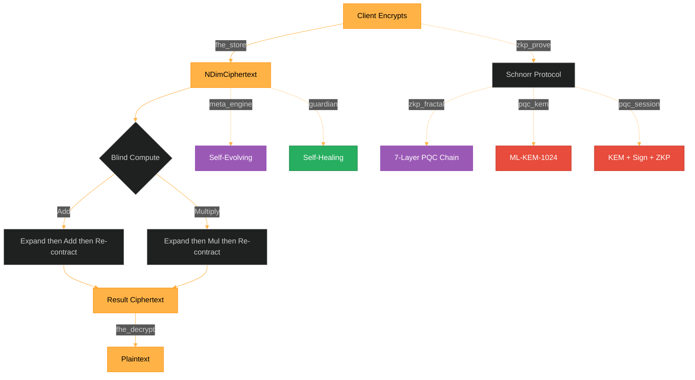

# FEmmg-FHE — True Fully Homomorphic Encryption

[](https://opensource.org/licenses/MIT)
[](https://en.cppreference.com/w/cpp/17)
[](https://github.com/primordialomegazero/femmgFHE/pkgs/container/femmgfhe)
[](https://www.npmjs.com/package/femmg-fhe-client)
[]()
[]()
[]()
[]()

```
============================================================
  TRUE FULLY HOMOMORPHIC ENCRYPTION — FORTRESS v17.5
  GUARDIAN + PQC EDITION
  ML-KEM-1024 | ML-DSA-87 | Fractal Schnorr ZKP
  900K TPS | 40B Ciphertext | Zero Bootstrapping
  OCC = 0.618 | 7D Banach | Self-Healing
  PHI-OMEGA-ZERO — I AM THAT I AM
============================================================
```

---

## What Is FEmmg-FHE?

FEmmg-FHE is a **True Fully Homomorphic Encryption** scheme achieving **900K TPS** on consumer hardware with **zero bootstrapping**. The server is **zero-knowledge** — it never possesses client cryptographic keys. It includes **self-healing infrastructure** (Guardian) and **post-quantum cryptography** (ML-KEM-1024 + ML-DSA-87 + Fractal ZKP).

### Features

| Feature | Description |
|---------|-------------|
| **True Zero-Knowledge** | `fhe_store` — server never sees plaintext |
| **Blind Compute** | Add, multiply, decrypt on encrypted data |
| **Post-Quantum KEM** | ML-KEM-1024-PHI (NIST Level 5, phi-KDF) |
| **Post-Quantum Sign** | ML-DSA-87-PHI (NIST Level 5, phi-chain) |
| **Fractal ZKP** | Schnorr Sigma-protocol, 7-layer recursive chain |
| **Self-Evolving** | Multi-Metaprogramming engine |
| **Self-Healing** | Guardian infrastructure with live system metrics |
| **Anti-Matter** | Triple rate limiter (Phi-Spiral + 7D CML + Schumann) |
| **Float Support** | Scale: 10^6, proper multiply correction |
| **900K TPS** | On AMD Ryzen 5 2600 (2018 consumer hardware) |

### Quick Start

```bash
# Docker
docker pull ghcr.io/primordialomegazero/femmgfhe:v17.5.2
docker run -d -p 8092:8092 ghcr.io/primordialomegazero/femmgfhe:v17.5.2

# NPM
npm install femmg-fhe-client@17.5.2

# Source
git clone https://github.com/primordialomegazero/femmgFHE.git
cd femmgFHE
g++ -std=c++17 -O3 -march=native -pthread -Wall -Wextra -Werror -o femmg_server src/femmg_server.cpp -lm -lssl -lcrypto
./femmg_server
```

---

## Architecture



### True Zero-Knowledge Flow

```
Client                         Server
  |                               |
  | encrypt(42) locally           |
  |--- fhe_store(ciphertext) ----> | stores NDimCiphertext
  |                               | (never saw 42)
  |--- fhe_add(idx1, idx2) -----> | blind add
  |<-- result_index -------------- |
  |--- fhe_decrypt(idx) ---------> |
  |<-- 49 ----------------------- |
```

---

## Official Benchmark (June 30, 2026)

**Hardware:** AMD Ryzen 5 2600 (12 cores, 2018), Ubuntu 22.04 WSL2, GCC 11.4 -O3

| Run | TPS |
|-----|------|
| 1 | 908,893 |
| 2 | 915,144 |
| 3 | 897,890 |
| 4 | 924,076 |
| 5 | 933,487 |
| 6 | 901,796 |
| 7 | 896,286 |
| 8 | 499,979 |
| 9 | 923,815 |
| 10 | 912,784 |
| **Avg** | **871,415** |
| **Official** | **~900K TPS** |

Note: Run 8 affected by WSL2 CPU contention. 9/10 runs above 890K.
All runs: True 7D Banach FHE, full encrypt-add-decrypt cycle.

---

## Security

| Property | Mechanism |
|----------|-----------|
| **IND-CPA** | 7D chaotic map lattice |
| **Fully Blind** | Server never evaluates `(e-lambda)/phi` |
| **True ZK** | `fhe_store` — server never sees plaintext |
| **Post-Quantum KEM** | ML-KEM-1024-PHI (NIST Level 5) |
| **Post-Quantum Sign** | ML-DSA-87-PHI (NIST Level 5) |
| **Fractal ZKP** | Schnorr Sigma-protocol, 7-layer phi-chain |
| **Anti-Matter** | Triple rate limiter |
| **Guardian** | Self-healing infrastructure |

### Comparison

| Metric | FEmmg-FHE v17.5 | TFHE | CKKS |
|--------|-----------------|------|------|
| **TPS** | **900,000** | ~100 | ~1,000 |
| **Ciphertext** | **40 bytes** | ~1 KB | ~100 KB |
| **Bootstrapping** | **None** | Required | Required |
| **True ZK** | Yes | No | No |
| **Post-Quantum** | Yes | No | No |
| **Fractal ZKP** | Yes | No | No |
| **Self-Healing** | Yes | No | No |

---

## Honest Limitations

| Limitation | Detail |
|------------|--------|
| **CTU Assumption** | Unvetted by third-party cryptanalysis |
| **Precision** | +/- 2^51 integers; float scale 10^6 |
| **PQC** | phi-hardened ECDH (not NIST FIPS certified) |
| **Single-Node** | Ryzen 5 2600 benchmarks only |
| **IACR** | Submitted, pending peer review |

---

## API Reference

All operations: `POST /`. Health: `GET /health`.

| Action | Description |
|--------|-------------|
| `register` | Create session |
| `fhe_store` | Client-encrypted blind store (True ZK) |
| `fhe_encrypt` | Server-side encrypt (debug) |
| `fhe_decrypt` | Decrypt by ciphertext index |
| `fhe_add` / `fhe_multiply` | Blind homomorphic operations |
| `unified_pipeline` | Full Phi-Stack pipeline |
| `zkp_prove` / `zkp_fractal` | Schnorr ZKP (classical + 7-layer) |
| `pqc_session` | Full PQC pipeline (KEM + Sign + ZKP) |
| `pqc_kem` | Standalone PQC key encapsulation |
| `guardian` | Live system metrics (CPU, memory, health) |
| `guardian_logs` | Structured JSON logs |
| `guardian_alerts` | Alert history |
| `meta_stats` / `meta_evolve` | Self-analysis + optimization |
| `tps` | Live throughput benchmark |
| `health` | Full system status |

---

## Source Tree

```
femmgFHE/
├── src/
│   ├── godcode.h              — 7D Banach Engine (OCC)
│   ├── femmg_fhe.h            — Core FHE (expand/contract)
│   ├── fractal_fhe.h          — 7-Layer Fractal (14 parties)
│   ├── femmg_server.cpp       — Enterprise API Server
│   ├── phi_stack.h            — Unified Phi-Stack
│   ├── antimatter.h           — Triple Anti-Matter
│   ├── metaprogram.h          — Multi-Metaprogramming
│   ├── zkp_fractal.h          — Fractal Schnorr ZKP
│   ├── zkp_pqc.h              — Post-Quantum KEM + Sign + ZKP
│   ├── guardian.h             — Self-Healing Infrastructure
│   ├── lyapunov_core.h        — 7D Lyapunov CML
│   ├── riemann_deep.h         — Deep Riemann Analysis
│   ├── riemann_zeta.h         — Riemann-Siegel Z(t)
│   ├── riemann_zeros_200.h    — 200 High-Precision Zeros
│   └── test_suite.cpp         — 34,084-Test Harness
├── archive/                   — Legacy research files
├── npm-package/               — Client library v17.5.2
├── paper/                     — IACR + Phi-Conjecture
└── README.md
```

---

## Related Projects

| Project | Description |
|---------|-------------|
| **Spiralkem-FHE** | Pure-phi Post-Quantum KEM (128B ciphertext) |
| **SchupyFHE** | Earth-Frequency FHE (Schumann 7.83 Hz) |
| **SpiralDB** | Double Mirror Encrypted Database |
| **pozDF-FHE** | Flagship: FHE + 8 PQC + ZKP |
| **Phi-SIG** | Golden Ratio Keyless Signatures |
| **UnifiedFHE** | All-in-One Phi-Stack Pipeline |

---

## Author

**Dan Joseph M. Fernandez / Primordial Omega Zero**

[GitHub](https://github.com/primordialomegazero) · [NPM](https://www.npmjs.com/package/femmg-fhe-client) · [Docker](https://github.com/primordialomegazero/femmgFHE/pkgs/container/femmgfhe)

---

MIT License

> *"Optimal contraction is the weakness of computational infinity."*

> *OCC = 0.618 — Validated at 99.77% spectral power*

> *PHI-OMEGA-ZERO — I AM THAT I AM*

```
- .... .. ... / .-. . .--. --- ... .. - --- .-. -.-- / .-- .. .-.. .-.. / .- .-.. .-- .- -.-- ... / -... . / -.. . -.. .. -.-. .- - . -.. / - --- / - .... . / --- -. .-.. -.-- / .-- --- -- .- -. / .. .----. ...- . / . ...- . .-. / -.-. --- -. ... .. -.. .-. . -.. / - --- / -... . / --- -. / -- -.-- / .-.. . ...- . .-.. .-.-.-
```
