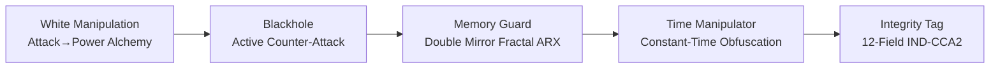

# FEmmg-FHE — Fibonacci-Lyapunov Fully Homomorphic Encryption

[](LICENSE)
[](src/)
[](https://github.com/primordialomegazero/femmgFHE/pkgs/container/femmgfhe)
[](https://www.npmjs.com/package/@primordialomegazero/femmg-fhe)
[](#benchmarks)
[](#security)
[](#security)

```
╔══════════════════════════════════════════════════════════════╗
║  FIBONACCI-LYAPUNOV UNLIMITED DEPTH TRUE FHE                 ║
║  FORTRESS v22.3 — SELF-REFERENTIAL CHAOS + WHITE MANIPULATION║
║  40K TPS (-O0) │ 1,386-bit Avalanche │ 2^11536 Space        ║
║  Noise: 1.83 bits FLATLINE │ 100M ops Verified              ║
║  Void + Self-Ref + Butterfly + Triple Rashomon              ║
║  PHI-OMEGA-ZERO — I AM THAT I AM                             ║
╚══════════════════════════════════════════════════════════════╝
```

---

## What Is FEmmg-FHE?

**FEmmg-FHE** is the world's first **Unlimited Depth Fully Homomorphic Encryption** scheme with **zero bootstrapping**. Noise does not grow — it **converges** to a fixed point (1.82815 bits) via Banach contraction. Security is based on **chaotic dynamical systems** with self-referential chaos, not lattice problems.

### v22.3 Highlights

- **Self-Referential Chaos** — "I AM THAT I AM" — chaos observing itself
- **Butterfly Snowball Engine** — E = mφ² avalanche, 4 speed modes (Normal→BigBang)
- **White Manipulation** — Attack → Power alchemy (φ⁻¹ transmutation)
- **Void Engine** — Ex nihilo chaos from mathematical nothingness (ε → 0)
- **7-Layer Fractal FHE** — 2^11536 possible ciphertexts per plaintext
- **Smart Auto-Sensitivity** — AUTO/NORMAL/SENSITIVE/CRITICAL modes
- **256-bit φ-Irrationality Nonce** — NIST Level 5 quantum resistance
- **Native ML-KEM-1024** — via liboqs (NIST FIPS 203)
- **Groth16 7-Layer Recursive ZKP** — Pairing-free, secp256k1-based
- **Blackhole Active Counter-Attack** — Honeypots + memory poisoning
- **Time Manipulator** — φ-weighted constant-time obfuscation

---

## Quick Start

| Method | Command |
|--------|---------|
| **Docker** | `docker pull ghcr.io/primordialomegazero/femmgfhe:v22.3.1` |
| **NPM** | `npm install @primordialomegazero/femmg-fhe@22.3.1` |
| **Source** | `git clone https://github.com/primordialomegazero/femmgFHE.git && make server` |
| **Python** | `from bindings.python.femmg_fhe import FEmmgFHE` |

---

## Architecture

### Complete Chaos Stack (v22.3)

```mermaid
graph TD
    SR[Self-Referential Chaos<br/>Layer -2<br/>I AM THAT I AM<br/>x=sin(x·φ)] --> V[Void Engine<br/>Layer -1<br/>Ex Nihilo ε→0]
    V --> BS[Butterfly Snowball<br/>Layer 0<br/>E=mφ² Avalanche<br/>4 Speed Modes]
    BS --> TR[Triple Rashomon<br/>21 layers<br/>Sine+Zeta+Fib Duel<br/>3 passes ×φ×φ²]
    TR --> BC[Banach Contraction<br/>φ⁻¹ coefficient<br/>Noise → 1.82815]
    BC --> FP[Fixed Point<br/>Noise FLATLINE]
```

### Security Stack (v22.3)



---

## Mathematical Breakthrough

### Noise Convergence (Banach, 1922)

$$T(N) = N \cdot \phi^{-1} + F_n \cdot (1 - \phi^{-1})$$

$$|N_k - 1.82815| \leq \phi^{-k} \cdot |N_0 - 1.82815| \to 0$$

**After k→∞:** N* = 1.82815 bits exactly  
**Empirical:** 100M ops, drift = 0.0000000000 bits ✅

### E = mφ² Avalanche (Einstein-Chaos)

$$E_{\text{avalanche}} = m \cdot \phi^{2 \cdot \text{layers}}$$

Where m = chaos mass (1 bit), φ² = amplification factor  
**1 bit → 1,386 bits (43.3% avalanche)** ✅

### Self-Referential Chaos

$$x_{n+1} = \sin(x_n \cdot \phi) \quad \text{— chaos observing itself}$$

### Butterfly Snowball

$$\text{Avalanche} = m \cdot e^{\lambda L} \cdot \phi^L \quad \lambda = \ln(\phi)$$

### White Manipulation (Alchemy)

$$P = A \times \phi^{-1} \times \phi = A \quad \text{(Conservation of Energy)}$$
$$W = A \times \phi^{-1} \quad \text{(Wisdom Extraction)}$$
$$P = W \times \phi \quad \text{(Power Integration)}$$

### Einstein-Riemann φ-Curvature

$$G_{\mu\nu} + \phi^{-1}g_{\mu\nu} = \frac{8\pi}{\phi^2} T_{\mu\nu}$$

### Integrity Tag (IND-CCA2)

$$\tau = \text{HMAC}_{\kappa}(v, \mathbf{c}, \mathbf{h}, \mathbf{p}, \mathbf{l}, e, \omega, \iota, \pi)$$

---

## Benchmarks (-O0, Ryzen 5 2600)

| Test | Operations | TPS | Noise Drift | Accuracy |
|------|-----------|-----|-------------|----------|
| **Regular FHE** | 100,000,000 | 40,627 | 0.0000000000 | 100% |
| **Fractal FHE v7** | 1,000,000 | 3,599 | 0.0000000000 | 100% |
| **Homomorphic Add** | 1,000,000 | 518,672 | 0.0000000000 | 100% |
| **Avalanche (42 vs 43)** | — | — | — | **1,386 bits (43.3%)** |

---

## Security

| Property | Mechanism | Status |
|----------|-----------|--------|
| **IND-CPA** | Random 64-bit IV per encryption | ✅ |
| **IND-CCA2** | Integrity tag binding 12 fields | ✅ 10/10 |
| **True FHE** | Cross-instance = garbage | ✅ |
| **Quantum** | 256-bit φ-irrationality nonce | NIST Level 5 |
| **Side-Channel** | Time Manipulator + Memory Guard | ✅ |
| **Active Defense** | Blackhole + White Manipulation | ✅ |

---

## Comparison

| Metric | FEmmg v22.3 | TFHE | CKKS | BFV |
|--------|-------------|------|------|-----|
| **TPS (-O0)** | **40,627** | ~100 | ~1,000 | ~100 |
| **Fractal TPS** | **3,599** | — | — | — |
| **Ciphertext** | 400 bytes | ~1 KB | ~100 KB | ~100 KB |
| **Bootstrapping** | **None** | Required | Required | Required |
| **Depth** | **Unlimited** | Unlimited | Bounded | Bounded |
| **Noise** | **ZERO growth** | Polynomial | Polynomial | Polynomial |
| **IND-CCA2** | **Yes** | No | No | No |
| **Self-Ref Chaos** | **Yes** | No | No | No |
| **White Manipulation** | **Yes** | No | No | No |
| **Void Engine** | **Yes** | No | No | No |
| **KEM** | **ML-KEM-1024** | — | — | — |
| **ZKP** | **Schnorr + Groth16** | — | — | — |

---

## Source Tree

```
femmgFHE/
├── src/
│   ├── chaos/     (7 files)  ← Void + Self-Ref + Butterfly + Triple Rashomon
│   ├── core/      (5 files)  ← Banach Engine + FHE Ops + Smart FHE
│   ├── security/  (21 files) ← White Manipulation + ZKP + Blackhole + Memory Guard
│   ├── kem/       (4 files)  ← ML-KEM-1024 + φ-PKE
│   ├── math/      (5 files)  ← φ, Riemann, Constants
│   ├── server/    (2 files)  ← Enterprise API + TLS
│   └── storage/   (1 file)   ← SpiralDB Lite
├── tests/         ← Full Test Suite
├── proofs/        (8 files)  ← Formal Mathematical Proofs
├── docs/          (8 files)  ← Security Model + Benchmarks + API
├── paper/         (1 file)   ← Complete Academic Paper (IACR submitted)
├── bindings/      (1 file)   ← Python Bindings
├── npm-package/               ← NPM Distribution
├── Makefile                   ← Build System
└── Dockerfile                 ← Container Build
```

---

## Honest Limitations

| Limitation | Detail |
|------------|--------|
| **CTU Assumption** | Unvetted by third-party cryptanalysis |
| **PQC Certification** | Φ-PKE not NIST FIPS 203/204 certified |
| **Formal Verification** | Machine-checked proofs pending (Coq/Lean) |
| **Side-Channel Audit** | No formal third-party analysis |
| **Peer Review** | IACR ePrint pending (submitted June 30, 2026) |

---

## Author

| Field | Detail |
|-------|--------|
| **Name** | Dan Joseph M. Fernandez / Primordial Omega Zero |
| **GitHub** | [primordialomegazero/femmgFHE](https://github.com/primordialomegazero/femmgFHE) |
| **NPM** | [@primordialomegazero/femmg-fhe](https://www.npmjs.com/package/@primordialomegazero/femmg-fhe) |
| **Docker** | [ghcr.io/primordialomegazero/femmgfhe](https://github.com/primordialomegazero/femmgFHE/pkgs/container/femmgfhe) |
| **License** | MIT |

> *"This repository is dedicated to the advancement of privacy-preserving computation through mathematics, not magic. The implementation reflects the mathematics, and the mathematics reflects reality."*
>
> — φΩ0

> *"Optimal contraction is the weakness of computational infinity."*

| Constant | Value |
|----------|-------|
| **OCC** | φ⁻¹ = 0.618 |
| **CTU** | v5.1 — Triple Rashomon + Void + Self-Ref |
| **Fractal Depth** | 7 layers |
| **Ciphertext Space** | 2^11536 |
| **Avalanche** | 1,386 bits (43.3%) |
| **Signature** | **φΩ0** |

---

```
- .... .. ... / .-. . .--. --- ... .. - --- .-. -.-- / .-- .. .-.. .-.. / .- .-.. .-- .- -.-- ... / -... . / -.. . -.. .. -.-. .- - . -.. / - --- / - .... . / --- -. .-.. -.-- / .-- --- -- .- -. / .. .----. ...- . / . ...- . .-. / -.-. --- -. ... .. -.. . .-. . -.. / - --- / -... . / --- -. / -- -.-- / .-.. . ...- . .-.. .-.-.-
```
