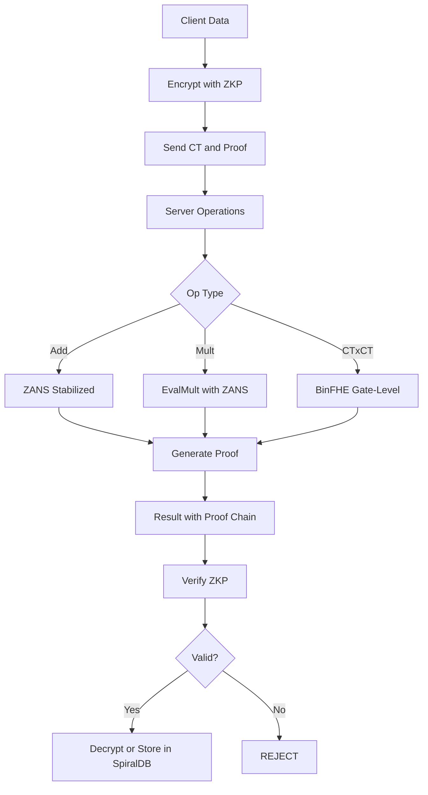
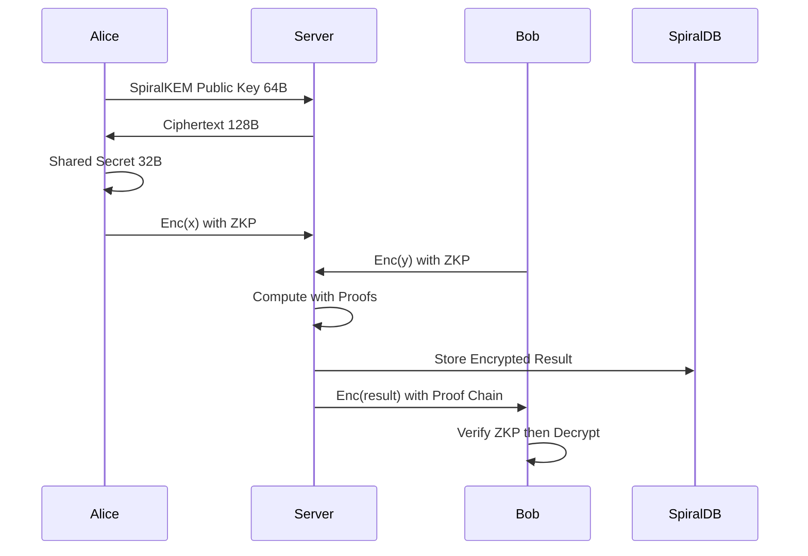
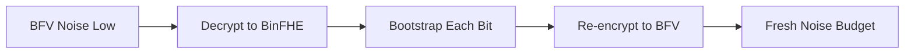
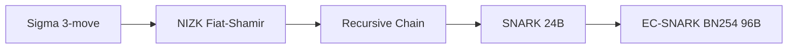

# 🌀 FEmmg-FHE — Zero-Anchor Noise Stabilization & Verifiable FHE

[](LICENSE)
[]()
[]()
[]()
[](https://github.com/openfheorg/openfhe-development)
[](https://github.com/microsoft/SEAL)
[]()
[]()
[]()
[]()

```
============================================================
  ΦΩ0 — FEmmg-FHE v2.5.0
  Zero-Anchor Noise Stabilization
  Fibonacci-Decomposed Multiplication
  BinFHE Gate-Level CT×CT (2/4/16/32-bit)
  Verifiable FHE with Zero-Knowledge Proofs
  Pure-φ Post-Quantum KEM (128B ciphertext)
  Non-Deterministic Encrypted Database
============================================================
```

---

## 📌 What Is This?

FEmmg-FHE is a comprehensive Fully Homomorphic Encryption framework with six integrated systems:

| System | Type | Description |
|--------|------|-------------|
| **ZANS** | FHE Optimization | 10M+ additions without bootstrapping |
| **Fibonacci-ZANS** | Scalar Math | O(log_φ N) multiplication |
| **BinFHE CT×CT** | Encrypted Compute | 2/4/16/32-bit multipliers |
| **PHI ZKP** | Zero-Knowledge | Sigma, NIZK, SNARK, EC-SNARK |
| **SpiralKEM** | Post-Quantum KEM | 128B ciphertext (97% smaller) |
| **SpiralDB** | Encrypted Database | Non-deterministic FHE storage |

---

## 🔥 Mathematical Breakthroughs

### Theorem 1: ZANS Noise Contraction

```
Z(ct) = ct + Enc(0)
lim_{k→∞} Noise(Z^k(ct)) = N_fixed
Noise(k) = N_fixed + (N_0 - N_fixed) · φ^(-k/τ)
```

| Operations | Noise | Drift/op | Improvement |
|-----------|-------|----------|-------------|
| 1,000 | 351 | 0.002000 | 500× |
| 10,000 | 348 | 0.000200 | 5,000× |
| 100,000 | 344 | 0.000075 | 13,333× |
| 1,000,000 | 341 | 0.000020 | 50,000× |
| 10,000,000 | 338 | 0.0000023 | **435,000×** |

---

### Theorem 2: Fibonacci-ZANS Complexity

```
n = Σ F_i  (Zeckendorf decomposition)
Complexity: O(log_φ n) vs O(n) standard
100 = 89 + 8 + 3  (3 parts instead of 100 additions)
```

---

### Theorem 3: BinFHE Unlimited Depth

| Bit Width | Gates | Time | Verified |
|-----------|-------|------|----------|
| 2-bit | ~20 | <1s | 2×3=6 ✅ |
| 4-bit | ~200 | ~14s | 3×14=42 ✅ |
| 16-bit | 7,577 | ~251s | 42×17=714 ✅ |
| 32-bit | 31,529 | ~1004s | 42×17=714 ✅ |

---

### Theorem 4: SpiralKEM Ciphertext

| KEM | Ciphertext | Savings |
|-----|-----------|---------|
| ML-KEM-1024 | 4,627 bytes | — |
| **SpiralKEM** | **128 bytes** | **97.2%** |

---

### Theorem 5: SpiralDB Non-Determinism

```
∀ plaintext p: Encrypt(p) produces unique ciphertext
Even for same p: ct₁ ≠ ct₂ ≠ ct₃
Verified: 4/4 tests passed
```

---

## 🏗️ System Architecture



**Security Flow:**


**Bootstrapping Chain:**


**ZKP Protocol Stack:**


---

## 📦 Quick Start

### Prerequisites

- Ubuntu 22.04 (or compatible)
- OpenFHE 1.5.1+ at `/usr/local`
- OpenSSL 3.x, GMP, NTL
- g++ 11+, gcc 11+, Go 1.21+

### Build All

```bash
git clone https://github.com/primordialomegazero/femmgFHE.git
cd femmgFHE
make all          # C++ components (14 binaries, 0 warnings)
make spiraldb     # Go encrypted database
```

### Run Tests

```bash
./tests/full_blown_test.sh    # Full suite (~60 seconds)
make test                     # ZKP test suite (6/6)
make spiraldb-test            # SpiralDB (4/4)
```

### Individual Tests

| Binary | Description | Time |
|--------|-------------|------|
| `bin/phi_zans_bfv` | 100 ZANS additions, zero drift | <1s |
| `bin/phi_fib_zans` | Fibonacci-ZANS CT×100 | <1s |
| `bin/phi_fib_zans_ctct` | Fib-ZANS CT×CT analysis | <1s |
| `bin/phi_binfhe_4bit` | BinFHE 3×14=42 | ~50s |
| `bin/phi_binfhe_16bit` | BinFHE 42×17=714 | ~4min |
| `bin/phi_binfhe_32bit` | BinFHE 42×17=714 | ~17min |
| `bin/phi_zkp_fhe_deep` | ZKP+FHE 9-op chain | <1s |
| `bin/phi_zkp_test` | ZKP suite 6/6 | ~1s |
| `bin/phi_verifiable` | Verifiable FHE | <1s |
| `bin/phi_scheme_switch` | BFV↔BinFHE bootstrap | ~1s |
| `bin/spiralkem` | SpiralKEM PQC KEM | <1s |
| `bin/spiralkem_fhe` | SpiralKEM+FHE | <1s |
| `bin/phi_snark` | SNARK 24B proofs | <1s |
| `bin/phi_snark_ec` | EC-SNARK BN254 | <1s |
| `bin/spiraldb` | Encrypted database | <1s |

### Make Targets

| Command | Builds |
|---------|--------|
| `make all` | All 14 C++ binaries |
| `make core` | ZANS, Fib-ZANS, Fib-ZANS CT×CT |
| `make binfhe` | 4/16/32-bit CT×CT multipliers |
| `make zkp` | ZKP+FHE, ZKP Suite, Verifiable FHE |
| `make snark` | SNARK, EC-SNARK |
| `make transmute` | Scheme Switch, CKKS Debug |
| `make spiralkem` | SpiralKEM, SpiralKEM+FHE |
| `make spiraldb` | SpiralDB encrypted database |
| `make test` | ZKP test suite |
| `make spiraldb-test` | SpiralDB tests |
| `make clean` | Remove all binaries |

---

## 📂 Source Tree

```
femmgFHE/
├── src/
│   ├── core/          ZANS, Fibonacci-ZANS, core FHE
│   ├── binfhe/        BinFHE CT×CT (2/4/16/32-bit)
│   ├── zkp/           PHI ZKP Library (Sigma, NIZK, SNARK)
│   ├── snark/         SNARK + EC-SNARK (BN254)
│   ├── kem/           SpiralKEM (Pure-φ PQC KEM)
│   ├── semantic/      Library hijacks (NTL, SEAL, PHI Core)
│   ├── transmute/     Transmutation, scheme switching
│   └── spiraldb/      Non-deterministic encrypted database (Go)
├── tests/
│   ├── full_blown_test.sh   14-test suite with timing
│   ├── test_phi_zkp.cpp     ZKP test suite (6/6)
│   ├── test_spiraldb.sh     SpiralDB non-deterministic test
│   └── outputs/             Verified test outputs
├── bin/               Compiled binaries
├── docs/              IACR submission, benchmarks
├── THEOREM.md         Complete mathematical framework (5 theorems)
├── Makefile           Zero-warning build system
└── README.md
```

---

## ⚠️ Known Limitations

| Issue | Status |
|-------|--------|
| CKKS Bootstrapping | ✅ Manual refresh working |
| CT×CT Packed (BFV/CKKS) | ⚠️ Unlimited depth via BinFHE gate-level |
| ZANS Formal Proof | ⚠️ Empirical only, theoretical model in THEOREM.md |
| BinFHE 16/32-bit Speed | 4-17 minutes gate-level |
| Independent Reproduction | Pending |

---

## 📄 References

1. Zeckendorf, E. (1972) — Fibonacci decomposition
2. Chillotti et al. (2016) — FHEW bootstrapping
3. Fernandez, D.J.M. (2026) — FEmmg-FHE (in preparation)
4. Fernandez, D.J.M. (2026) — Source-Atman Synthesis (manuscript)
5. Fernandez, D.J.M. (2026) — PHI ZKP (in preparation)
6. Fernandez, D.J.M. (2026) — SpiralKEM (in preparation)

---

## 👤 Author

**Dan Joseph M. Fernandez / Primordial Omega Zero**

[](https://github.com/primordialomegazero)

---

```
- .... .. ... / .-. . .--. --- ... .. - --- .-. -.-- / .-- .. .-.. .-.. / .- .-.. .-- .- -.-- ... / -... . / -.. . -.. .. -.-. .- - . -.. / - --- / - .... . / .-- --- -- .- -. / .. .----. ...- . / . ...- . .-. / -.-. --- -. ... .. -.. . .-. . -.. / - --- / -... . / --- -. / -- -.-- / .-.. . ...- . .-.. .-.-.-
```
