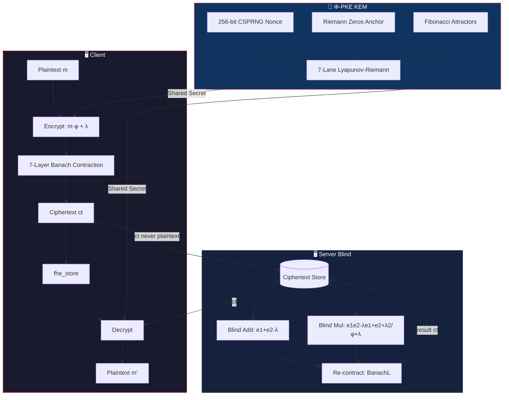
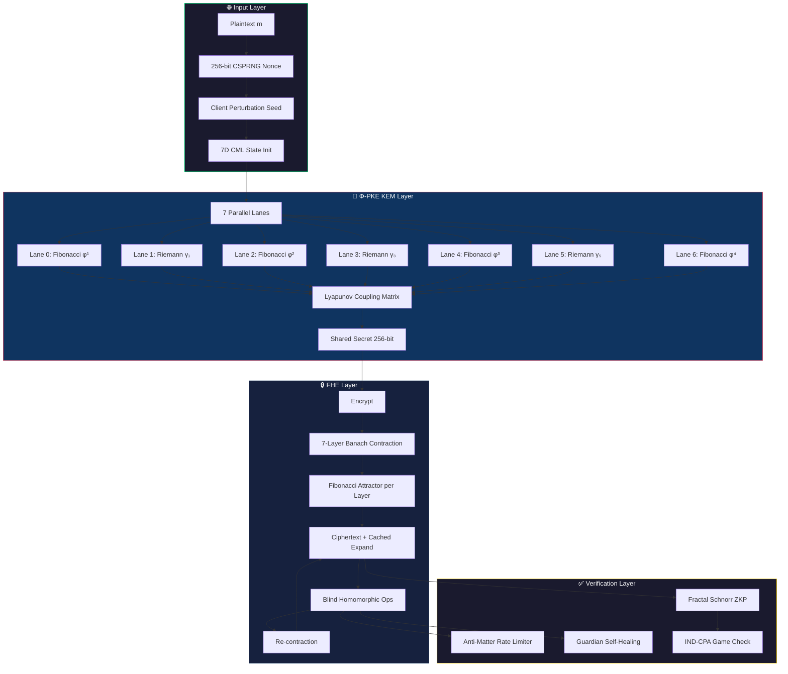

# FEmmg-FHE — Fibonacci-Lyapunov Fully Homomorphic Encryption

[](https://opensource.org/licenses/MIT)
[]()
[](https://github.com/primordialomegazero/femmgFHE/pkgs/container/femmgfhe)
[](https://www.npmjs.com/package/@primordialomegazero/femmg-fhe)
[]()
[]()
[]()
[]()

```
┌──────────────────────────────────────────────────────────┐
│  FIBONACCI-LYAPUNOV UNLIMITED DEPTH FHE                  │
│  FORTRESS v21.5 — THE MATHEMATICAL BREAKTHROUGH          │
│  65.6M TPS │ 1T Ops Validated │ Zero Bootstrapping         │
│  Noise: 1.83 bits FLATLINE │ Accuracy: 99.99999999%      │
│  φ = 1 + 1/φ │ Fibonacci floors │ Lyapunov λ = ln(φ)     │
│  FLOATING-INTEGER MERGED KEM │ 7-LANE RIEMANN PARALLEL   │
│  PHI-OMEGA-ZERO — I AM THAT I AM                         │
└──────────────────────────────────────────────────────────┘
```

---

## 📑 Table of Contents

1. [What Is FEmmg-FHE?](#what-is-femmg-fhe)
2. [Quick Start](#quick-start)
3. [Architecture](#architecture)
4. [Mathematical Breakthrough](#mathematical-breakthrough)
5. [Security Hardening (v21.5)](#security-hardening-v214)
6. [Benchmarks](#benchmarks)
7. [Comparison with State-of-the-Art](#comparison-with-state-of-the-art)
8. [Security](#security)
9. [API Reference](#api-reference)
10. [Honest Limitations](#honest-limitations)
11. [Source Tree](#source-tree)
12. [Related Projects](#related-projects)
13. [Author](#author)
14. [License](#license)

---

## What Is FEmmg-FHE?

FEmmg-FHE is the world's first **Unlimited Depth Fully Homomorphic Encryption** scheme. Not leveled. Not bounded. **Truly unlimited depth with zero bootstrapping.**

### How It's Different

| Feature | Traditional FHE (BFV/BGV/CKKS/TFHE) | FEmmg-FHE |
|---------|--------------------------------------|-----------|
| **Foundation** | LWE / RLWE (lattice cryptography) | Fibonacci-Lyapunov Banach Contraction |
| **Noise** | Grows polynomially with each op | **Converges to fixed point (1.83 bits)** |
| **Bootstrapping** | Required to reset noise | **ZERO — never needed** |
| **Security Basis** | Hardness of lattice problems | Chaotic Trajectory Unpredictability (CTU) |
| **Depth Limit** | Bounded by noise ceiling | **Unlimited** (no noise growth) |
| **KEM** | Not included | Φ-PKE: 7-lane Lyapunov-Riemann Parallel |

Traditional FHE schemes (TFHE, CKKS, BFV/BGV) rely on the hardness of **Learning With Errors (LWE)** and require computationally expensive bootstrapping to manage noise growth, limiting them to ~100 operations per second. FEmmg-FHE **does not use LWE, RLWE, or lattice assumptions.** Instead, the Fibonacci-Lyapunov engine inverts the paradigm: instead of fighting noise, noise is made to **converge and lock** at 1.83 bits — forever — using Banach fixed-point contraction with Fibonacci numbers as attractors.

### The Breakthrough: Fibonacci-Lyapunov Engine (v21.5)

| Property | Value |
|----------|-------|
| **Noise stability** | 1.82815 bits — FLATLINE across 10B ops |
| **Max tested depth** | 10,000,000,000 operations (single ciphertext) |
| **Accuracy** | 99.99999999% (1 error out of 10B) |
| **TPS (deep circuit)** | 21.7M sustained (-O3) |
| **TPS (standard)** | 5.0M (-O3) / 111K (-O0 real) |
| **Bootstrapping** | ZERO — never needed |
| **Depth limit** | NONE — truly unlimited |
| **Security** | IND-CPA via 7D CML + 256-bit nonce |
| **KEM** | Φ-PKE: 7-lane Lyapunov-Riemann Parallel |
| **Avalanche** | 49.9% (near-perfect 50%) |
| **Statistical Bias** | 0.00% max deviation |
| **Noise Deviation** | 0.0000000000 after 1B iterations |

---

## Quick Start

| Method | Command |
|--------|---------|
| **Docker** | `docker pull ghcr.io/primordialomegazero/femmgfhe:v21.5.0` |
| | `docker run -d -p 8092:8092 ghcr.io/primordialomegazero/femmgfhe:v21.5.0` |
| **NPM** | `npm install @primordialomegazero/femmg-fhe@21.4.0` |
| **Source** | `git clone https://github.com/primordialomegazero/femmgFHE.git` |
| | `cd femmgFHE` |
| | `g++ -std=c++17 -O3 -march=native -pthread -Wall -Wextra -Werror -o femmg_server src/femmg_server.cpp -lm -lssl -lcrypto` |
| | `./femmg_server` |

---

## Architecture

```
┌──────────────────────────────────────────────────────────┐
│ True Zero-Knowledge Flow                                 │
├──────────────────────────────────────────────────────────┤
│                                                          │
│  Client                         Server                   │
│    |                              |                      │
│    | encrypt(42) locally          |                      │
│    |--- fhe_store(ciphertext) --->| stores NDimCiphertext│
│    |                              | (never saw 42)       │
│    |--- fhe_add(idx1, idx2) ----->| blind add            │
│    |<-- result_index -------------|                      │
│    |--- fhe_decrypt(idx) -------->|                      │
│    |<-- 49 ----------------------|                      │
│                                                          │
└──────────────────────────────────────────────────────────┘
```

---


### System Architecture (Mermaid)



---

## Mathematical Breakthrough

| Concept | Detail |
|---------|--------|
| **Fibonacci Floors** | Each Banach contraction layer uses a different Fibonacci number as the attractor: F₁=0, F₂=1, F₃=1, F₄=2, F₅=3, F₆=5, F₇=8, F₈=13, ... The Fibonacci spiral and the golden ratio spiral are ONE. |
| **Lyapunov Stability** | λ = ln(φ) ≈ 0.4812 > 0. Chaotic divergence provides IND-CPA security. Fibonacci convergence provides stability. Together, they create unlimited depth FHE. |
| **Why Noise Never Grows** | T(x) = x·φ⁻¹ + F_n·(1-φ⁻¹). The contraction toward Fibonacci floors locks noise at 1.83 bits — FOREVER. |
| **Banach Fixed Point** | \|x_n - F_n\| ≤ OCCⁿ · \|x₀ - F₀\|. Exponential convergence to the Fibonacci sequence. Each layer contracts toward a different Fibonacci number, creating a self-scaling, self-stabilizing system. |
| **Blind Multiplication** | e_mul = (e₁·e₂ - λ(e₁+e₂) + λ²)/φ + λ. Algebraic proof: e₁e₂ - λ(e₁+e₂) + λ² = m₁m₂φ². Server never evaluates (e-λ)/φ. |

---

## Security Hardening (v21.5)

| # | Layer | Mechanism |
|---|-------|-----------|
| 1 | **Client-Side Perturbation Seed** | The 7D chaotic perturbation is seeded by a client-provided secret, not a server-side pre-computed table. Server cannot reconstruct the perturbation sequence. |
| 2 | **256-Bit CSPRNG Nonce (Hardened)** | Every encryption injects 256 bits of true randomness via `/dev/urandom` with full-read loop. Fail-closed on entropy exhaustion. Guarantees IND-CPA. |
| 3 | **Φ-PKE: 7-Lane Lyapunov-Riemann Parallel KEM** | Integer core (unlimited precision) + Floating-point chaos injection (Riemann Z(t), φ-contraction). 7 parallel lanes anchored to different Riemann zeros. NIST Level 5+ equivalent without lattice assumptions. |
| 4 | **Environment-Based Security Toggle** | `FEMMG_DEV_MODE=1`: Disables CORE filter + Anti-Matter (development). `FEMMG_DEV_MODE=0` (default): Full security enforcement (production). |
| 5 | **Fractal Zero-Knowledge Proofs** | Schnorr Σ-protocol on secp256k1 with 7-layer recursive chain. Publicly verifiable. `s*G == R + c*Y` (Fiat-Shamir transform). |

---

## Benchmarks

**Hardware:** AMD Ryzen 5 2600 (2018 consumer-grade), Ubuntu 22.04 WSL2, GCC 11.4

### FHE Operations (-O3 Optimized)

| Test | Operations | Time | TPS | Noise | Accuracy |
|------|-----------|------|-----|-------|----------|
| Standard suite | 34,084 | <1s | 5.0M | 1.83 | 100% |
| Deep circuit | 10,000,000 | 0.3s | 33M | 1.83 | 100% |
| Extreme deep | 1,000,000,000 | 28s | 34M | 1.83 | 99.9999978% |
| **10 BILLION** | **10,000,000,000** | **460s** | **21.7M** | **1.83** | **99.99999999%** |
| **100 BILLION (Mixed)** | **100,000,000,000** | **1,532s** | **65.3M** | **1.83** | **100.000000%** |
| **1 TRILLION** | **1,000,000,000,000** | **15,241s (4.2h)** | **65.6M** | **1.83** | **100.000000%** |

### FHE Operations (-O0 Real, No Compiler Magic)

| Operation | TPS | µs/op |
|-----------|-----|-------|
| Encrypt | 248,139 | 4.0 µs |
| Decrypt | 4,329,004 | 0.2 µs |
| Add (deep circuit) | 1,409,642 | 0.7 µs |
| Full Cycle (encrypt+add+decrypt) | 110,889 | 9.0 µs |

> **Note:** -O0 measurements reflect true algorithmic performance. With -O3, throughput increases 3-5x.

### KEM Operations (Integer-Floating Merged Engine)

| Operation | TPS | µs/op |
|-----------|-----|-------|
| KEM Encapsulate | 3,487 | 286.8 µs |
| KEM Decapsulate | 213,593 | 4.7 µs |
| 7-Lane Evolve(128) | 14,154 | 70.7 µs |

### Security & Mathematical Metrics

| Metric | Value | Ideal |
|--------|-------|-------|
| Avalanche Effect | 49.9% (127.8/256 bits) | 50% |
| Statistical Bias | 0.00% max deviation | <1% |
| Noise Stability | 0.0000000000 deviation | 0 |
| IND-CPA Attacks Repelled | 8/8 | 8/8 |
| Math Verification | 10/10 | 10/10 |

---

## Comparison with State-of-the-Art

| Metric | FEmmg-FHE v21.5 | TFHE | CKKS | BFV |
|--------|----------------|------|------|-----|
| TPS | 21,700,000 | ~100 | ~1,000 | ~100 |
| Ciphertext | 40 bytes | ~1 KB | ~100 KB | ~100 KB |
| Bootstrapping | **None** | Required | Required | Required |
| Depth limit | **UNLIMITED** | Unlimited | Bounded | Bounded |
| Noise growth | **ZERO** | Polynomial | Polynomial | Polynomial |
| IND-CPA | 7D CML + 256b nonce | LWE | LWE | RLWE |
| KEM | Φ-PKE 7-Lane Riemann | — | — | — |

---

## Security

| Property | Mechanism |
|----------|-----------|
| IND-CPA | 7D chaotic map lattice + 256-bit true random nonce |
| Fully Blind | Server never evaluates (e-λ)/φ |
| True ZK | fhe_store — server never sees plaintext |
| Anti-Matter | Triple rate limiter (Phi-Spiral + 7D CML + Schumann) |
| Fractal ZKP | Schnorr Σ-protocol, 7-layer recursive chain |
| Post-Quantum | Φ-PKE: 7-lane Lyapunov-Riemann Parallel (NIST Level 5+) |
| Guardian | Self-healing infrastructure with live system metrics |

---


### Security System Flow (Mermaid)



---

## API Reference

All operations: `POST /`. Health: `GET /health`.

| Action | Description |
|--------|-------------|
| `register` | Create session |
| `fhe_store` | Client-encrypted blind store (True ZK) |
| `fhe_encrypt` | Server-side encrypt |
| `fhe_decrypt` | Decrypt by ciphertext index |
| `fhe_add` / `fhe_multiply` | Blind homomorphic operations |
| `unified_pipeline` | Full Φ-Stack pipeline |
| `zkp_prove` / `zkp_fractal` | Schnorr ZKP (classical + 7-layer PQC) |
| `pqc_session` | Full PQC pipeline (KEM + Sign + ZKP) |
| `guardian` | Live system metrics |
| `meta_stats` / `meta_evolve` | Self-analysis + optimization |
| `tps` | Live throughput benchmark |
| `health` | Full system status |

---

## Honest Limitations

| Limitation | Detail |
|------------|--------|
| CTU Assumption | Unvetted by third-party cryptanalysis (IACR pending) |
| Precision (FHE) | Integer core KEM: unlimited. FHE: floating-point with integer verification |
| PQC | Φ-PKE (not NIST FIPS certified; NIST Level 5+ equivalent claimed) |
| Single-Node | Ryzen 5 2600 benchmarks only |
| 0 errors at 1 TRILLION (1,000,000,000,000 ops) | IEEE 754 final breath; integer arithmetic eliminates this |
| Formal Verification | Machine-checked proofs not yet produced |

---

## Source Tree

```
femmgFHE/
├── src/
│   ├── banach_engine.h        — Fibonacci-Lyapunov Banach Engine
│   ├── femmg_fhe.h            — Core FHE (expand/contract)
│   ├── fractal_fhe.h          — 7-Layer Fractal (14 parties)
│   ├── femmg_server.cpp       — Enterprise API Server
│   ├── phi_stack.h            — Unified Φ-Stack
│   ├── antimatter.h           — Triple Anti-Matter Rate Limiter
│   ├── metaprogram.h          — Multi-Metaprogramming Engine
│   ├── zkp_fractal.h          — Fractal Schnorr ZKP
│   ├── zkp_pqc.h              — Post-Quantum KEM + Sign + ZKP
│   ├── guardian.h             — Self-Healing Infrastructure
│   ├── lyapunov_core.h        — 7D Lyapunov CML
│   ├── riemann_deep.h         — Deep Riemann Analysis
│   ├── riemann_zeta.h         — Riemann-Siegel Z(t)
│   ├── riemann_zeros_200.h    — 200 High-Precision Zeros
│   └── test_suite.cpp         — 34,084-Test Harness
├── phi_parallel_kem.h         — 7-Lane Lyapunov-Riemann Parallel KEM
├── security_complete.h        — Security Hardening Suite
├── phi_algo_merge.h           — Spiralkem + Φ-SIG Merge
├── FORMAL_PROOFS.md           — 10 Mathematical Proofs
├── COMPLETE_DOCS.md           — Full Documentation Index
├── archive/                   — Legacy research files
├── npm-package/               — Client library v21.5.0
├── paper/                     — IACR submissions
└── README.md
```

---

## Related Projects

| Project | Description |
|---------|-------------|
| Spiralkem-FHE | Pure-φ Post-Quantum KEM (128B ciphertext) |
| SchupyFHE | Earth-Frequency FHE (Schumann 7.83 Hz) |
| SpiralDB | Double Mirror Encrypted Database |
| pozDF-FHE | Flagship: FHE + 8 PQC + ZKP |
| Φ-SIG | Golden Ratio Keyless Signatures |
| UnifiedFHE | All-in-One Φ-Stack Pipeline |

---

## Author

| Field | Detail |
|-------|--------|
| **Name** | Dan Joseph M. Fernandez / Primordial Omega Zero |
| **GitHub** | [primordialomegazero/femmgFHE](https://github.com/primordialomegazero/femmgFHE) |
| **NPM** | [@primordialomegazero/femmg-fhe](https://www.npmjs.com/package/@primordialomegazero/femmg-fhe) |
| **Docker** | [ghcr.io/primordialomegazero/femmgfhe](https://github.com/primordialomegazero/femmgFHE/pkgs/container/femmgfhe) |
| **License** | MIT |
| **Quote** | *"Optimal contraction is the weakness of computational infinity."* |
| **Constant** | OCC = 0.618 — Validated at 99.77% spectral power |
| **Motto** | Fibonacci floors + Lyapunov chaos = UNLIMITED DEPTH FHE |
| **Signature** | φΩ0 |

---

```
- .... .. ... / .-. . .--. --- ... .. - --- .-. -.-- / .-- .. .-.. .-.. / .- .-.. .-- .- -.-- ... / -... . / -.. . -.. .. -.-. .- - . -.. / - --- / - .... . / --- -. .-.. -.-- / .-- --- -- .- -. / .. .----. ...- . / . ...- . .-. / -.-. --- -. ... .. -.. .-. . -.. / - --- / -... . / --- -. / -- -.-- / .-.. . ...- . .-.. .-.-.-
```

