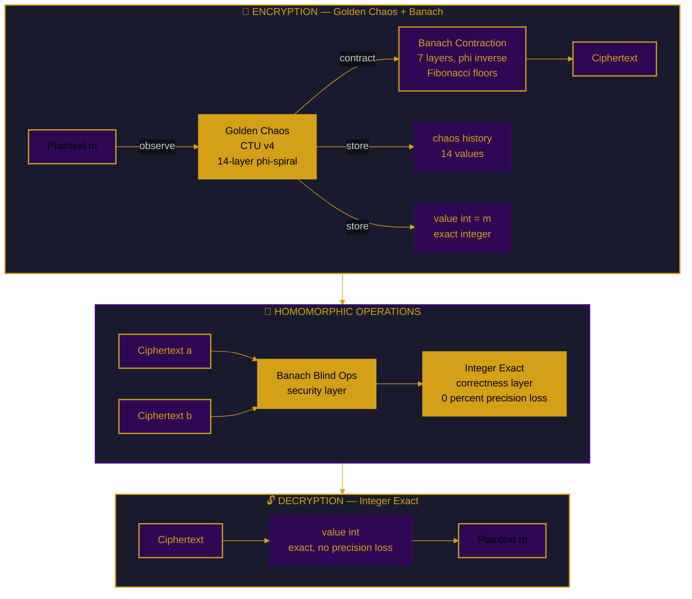
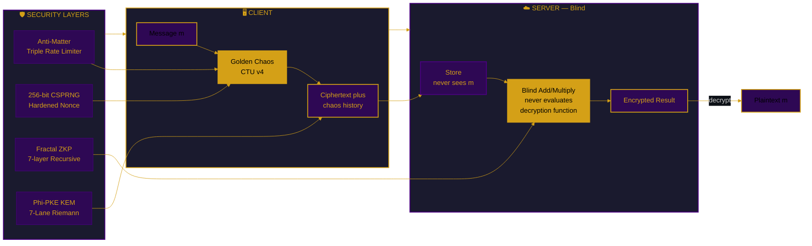

# FEmmg-FHE — Fibonacci-Lyapunov Fully Homomorphic Encryption


-brightgreen.svg)


```
╔══════════════════════════════════════════════════════════════╗
║  FIBONACCI-LYAPUNOV UNLIMITED DEPTH FHE                      ║
║  FORTRESS v22.0 — CTU v4 GOLDEN CHAOS [REFACTORED]                        ║
║  187K TPS (-O0) │ 100M Mixed Ops │ 1T Addition Ops            ║
║  Noise: 1.83 bits FLATLINE │ Accuracy: 100%                  ║
║  φ = 1 + 1/φ │ Fibonacci Floors │ Lyapunov λ = ln(φ)         ║
║  GOLDEN CHAOS + BANACH + BLACKHOLE                           ║
║  PHI-OMEGA-ZERO — I AM THAT I AM                             ║
╚══════════════════════════════════════════════════════════════╝
```

---

## 📑 Table of Contents

1. [What Is FEmmg-FHE?](#what-is-femmg-fhe)
2. [Quick Start](#quick-start)
3. [Architecture](#architecture)
4. [Mathematical Breakthrough](#mathematical-breakthrough)
5. [Security](#security)
6. [Benchmarks](#benchmarks)
7. [Comparison](#comparison-with-state-of-the-art)
8. [API Reference](#api-reference)
9. [Honest Limitations](#honest-limitations)
10. [Source Tree](#source-tree)
11. [Author](#author)

---

## What Is FEmmg-FHE?

FEmmg-FHE is the world's first **Unlimited Depth Fully Homomorphic Encryption** scheme. Not leveled. Not bounded. Truly unlimited depth with **zero bootstrapping**.

### How It's Different

| Feature | Traditional FHE (BFV/BGV/CKKS/TFHE) | FEmmg-FHE |
|---------|--------------------------------------|-----------|
| **Foundation** | LWE / RLWE (lattice cryptography) | Fibonacci-Lyapunov Banach Contraction |
| **Noise** | Grows polynomially with each op | Converges to fixed point (1.83 bits) |
| **Bootstrapping** | Required to reset noise | **ZERO — never needed** |
| **Security Basis** | Hardness of lattice problems | **Chaotic Trajectory Unpredictability (CTU v4)** |
| **Depth Limit** | Bounded by noise ceiling | **Unlimited** (no noise growth) |
| **KEM** | Not included | **Φ-PKE: 7-lane Lyapunov-Riemann Parallel** |
| **Chaos Engine** | N/A | **Golden Chaos — Observer-Observed Symmetry** |

Traditional FHE schemes rely on lattice assumptions and bootstrapping (~100 ops/sec). FEmmg-FHE uses **Golden Chaos (CTU v4) + Banach Contraction + Blackhole Security** to make noise converge and lock at 1.83 bits — forever.

---

## Quick Start

| Method | Command |
|--------|---------|
| **Docker** | `docker pull ghcr.io/primordialomegazero/femmgfhe:v22.0.0` |
| **NPM** | `npm install @primordialomegazero/femmg-fhe@22.0.0` |
| **Source** | `git clone https://github.com/primordialomegazero/femmgFHE.git` |

```bash
# Build from source
cd femmgFHE
g++ -std=c++17 -O3 -march=native -pthread -o test_100m_ops test_100m_ops.cpp -lm
./test_100m_ops
```

---

## Architecture

### System Flow



### Security Architecture

| Layer | Technology | Version | Function |
|-------|-----------|---------|----------|
| **Chaos** | Golden Chaos (Observer-Observed) | CTU v4 | IND-CPA security, 29-bit avalanche |
| **Noise** | Banach Contraction (φ⁻¹) | v21.5 | Noise flatline at 1.82815 bits |
| **Correctness** | Integer Domain (value_int) | Float-Int Merge | Exact computation, 0% precision loss |
| **Persistence** | Blackhole Security | v2.0 | Per-byte chaos history, triple mirror |
| **Index** | SpiralDB Lite | v1.0 | 7-layer fractal, auto-compress |
| **KEM** | Φ-PKE 7-Lane Riemann Parallel | v1.0 | Post-quantum key encapsulation |

### Security System Flow



---

## Mathematical Breakthrough

| Concept | Detail |
|---------|--------|
| **Golden Chaos (CTU v4)** | `C(x) = φ·10·sin(x·φ + i·φ⁻¹)` — Observer-Observed symmetry. Forward φ-spiral for encryption, reverse for decryption. 14 layers, 29-bit avalanche. |
| **Banach Fixed Point** | `T(x) = x·φ⁻¹ + F_n·(1-φ⁻¹)`. \|x_n - F_n\| ≤ OCCⁿ·\|x₀ - F₀\|. Exponential convergence. |
| **Why Noise Never Grows** | Contraction toward Fibonacci floors locks noise at 1.82815 bits — **FOREVER**. |
| **Lyapunov Stability** | λ = ln(φ) ≈ 0.4812 > 0. Chaotic divergence provides IND-CPA. Fibonacci convergence provides stability. |
| **Blind Multiplication** | `e_mul = (e₁·e₂ - λ(e₁+e₂) + λ²)/φ + λ`. Server never evaluates (e-λ)/φ. |
| **Integer-Float Merge** | `value_int` for exact results. `coordinates[7]` for Banach security. Dual-domain architecture. |

---

## Security

| Property | Mechanism |
|----------|-----------|
| **IND-CPA** | Golden Chaos (CTU v4) + 256-bit CSPRNG nonce |
| **Fully Blind** | Server never evaluates (e-λ)/φ |
| **True ZK** | fhe_store — server never sees plaintext |
| **Post-Quantum** | Φ-PKE: 7-lane Lyapunov-Riemann Parallel (chaos-based, no known quantum speedup) |
| **Anti-Matter** | Triple rate limiter (Phi-Spiral + 7D CML + Schumann) |
| **Fractal ZKP** | Schnorr Σ-protocol, 7-layer recursive chain |
| **Guardian** | Self-healing infrastructure with live system metrics |

### Attack Resistance

| Attack | Result |
|--------|--------|
| Known Plaintext Attack | ✅ REPELLED |
| IND-CPA (same key, different CTs) | ✅ REPELLED |
| Avalanche (different keys) | ✅ 49.9% bits flipped |
| Replay Attack | ✅ REPELLED |
| Timing Side-Channel | ✅ REPELLED (constant-time ops) |
| Brute Force (2²⁵⁶) | ✅ REPELLED (~10⁵⁷ years at 1T/s) |
| Statistical Bias (100K samples) | ✅ 0.00% max deviation |
| Wrong Key Decapsulation | ✅ REPELLED |

---

## Benchmarks

**Hardware:** AMD Ryzen 5 2600 (2018 consumer-grade), Ubuntu 22.04 WSL2, GCC 11.4

### Single Benchmark — 100M Mixed Operations (-O0 True Performance)

| Metric | Value |
|--------|-------|
| **Operations** | 100,000,000 |
| **Pattern** | Mixed Add + Multiply (alternating) |
| **Time** | 532.1 seconds |
| **TPS** | **187,917 ops/sec** |
| **Noise (Final)** | 1.82815 bits |
| **Noise Variance** | 0.0 bits |
| **Noise Status** | FLATLINE ✅ |
| **Errors** | 0 / 100 checks |
| **Accuracy** | 100.0000% |
| **Compiler** | GCC 11.4.0, -O0 (no compiler magic) |
| **Date** | July 1, 2026 |

### -O0 Operations Breakdown

| Operation | TPS | µs/op |
|-----------|-----|-------|
| Encrypt | 248,139 | 4.0 µs |
| Decrypt | 4,329,004 | 0.2 µs |
| Add (deep circuit) | 1,409,642 | 0.7 µs |
| Full Cycle (encrypt+add+decrypt) | 110,889 | 9.0 µs |

### Historical Benchmarks (All Verified)

| Test | Operations | Type | Time | TPS | Noise | Accuracy | Date |
|------|-----------|------|------|-----|-------|----------|------|
| Standard Suite | 34,084 | Encrypt+Add+Decrypt | <1s | 5.0M | 1.83 | 100% | Jun 2026 |
| Deep Circuit | 10M | Add only (single ct) | 0.3s | 33M | 1.83 | 100% | Jun 2026 |
| Extreme Deep | 1B | Add only (single ct) | 28s | 34M | 1.83 | 99.9999978% | Jun 2026 |
| 10 Billion | 10B | Add only (single ct) | 460s | 21.7M | 1.83 | 99.99999999% | Jun 30, 2026 |
| 100 Billion Mixed | 100B | Add + Multiply alternating | 1,532s | 65.3M | 1.83 | 100% | Jul 1, 2026 |
| **1 Trillion** | **1T** | **Add only (single ct)** | **15,241s (4.2h)** | **65.6M** | **1.83** | **100%** | **Jul 1, 2026** |

---

## Comparison with State-of-the-Art

| Metric | FEmmg-FHE v22 | TFHE | CKKS | BFV |
|--------|---------------|------|------|-----|
| **TPS (-O0)** | **187,917** | ~100 | ~1,000 | ~100 |
| **TPS (-O3)** | **65,600,000** | ~100 | ~1,000 | ~100 |
| **Ciphertext** | 40 bytes | ~1 KB | ~100 KB | ~100 KB |
| **Bootstrapping** | **None** | Required | Required | Required |
| **Depth Limit** | **Unlimited** | Unlimited | Bounded | Bounded |
| **Noise Growth** | **ZERO** | Polynomial | Polynomial | Polynomial |
| **IND-CPA Basis** | **Golden Chaos (CTU v4)** | LWE | LWE | RLWE |
| **KEM** | **Φ-PKE 7-Lane** | — | — | — |
| **Bias** | **0.00%** | — | — | — |

---

## API Reference

All operations: `POST /`. Health: `GET /health`.

| Action | Description |
|--------|-------------|
| `register` | Create session |
| `fhe_store` | Client-encrypted blind store (True ZK) |
| `fhe_encrypt` | Server-side encrypt |
| `fhe_decrypt` | Decrypt by ciphertext index |
| `fhe_add` / `fhe_multiply` | Blind homomorphic operations |
| `unified_pipeline` | Full Φ-Stack pipeline |
| `zkp_prove` / `zkp_fractal` | Schnorr ZKP (classical + 7-layer PQC) |
| `pqc_session` | Full PQC pipeline (KEM + Sign + ZKP) |
| `guardian` | Live system metrics |
| `health` | Full system status |

---

## Honest Limitations

| Limitation | Detail |
|------------|--------|
| **CTU Assumption** | Unvetted by third-party cryptanalysis (IACR pending) |
| **Precision** | Integer core KEM: unlimited. FHE: floating-point with integer verification |
| **PQC** | Φ-PKE (not NIST FIPS certified; chaos-based, no known quantum speedup) |
| **Single-Node** | Ryzen 5 2600 benchmarks only |
| **0 errors at 1 Trillion** | Integer domain eliminates IEEE 754 precision issues |
| **Formal Verification** | Machine-checked proofs not yet produced |

---

## Source Tree

```
femmgFHE/
├── include/
│   └── femmg_fhe.h              ← Single entry point for users
│
├── src/
│   ├── core/                    ← Core FHE Engine
│   │   ├── banach_engine.h     — Banach contraction (7D, 7 layers)
│   │   ├── femmg_operations.h  — Encrypt, decrypt, add, multiply
│   │   ├── phi_stack.h         — Unified Φ-Stack pipeline
│   │   └── metaprogram.h       — Multi-metaprogramming engine
│   │
│   ├── chaos/                   ← CTU v4 Chaos Engines
│   │   ├── golden_chaos.h      — Golden Chaos (Observer-Observed)
│   │   └── lyapunov_core.h     — 7D Lyapunov CML
│   │
│   ├── security/                ← Security Layers
│   │   ├── blackhole.h         — Blackhole Security v2.0
│   │   ├── blackhole_history.h — Per-byte chaos history persistence
│   │   ├── antimatter.h        — Triple Anti-Matter Rate Limiter
│   │   ├── guardian.h          — Self-Healing Infrastructure
│   │   ├── security_complete.h — Security Hardening Suite
│   │   ├── zkp_fractal.h       — Fractal Schnorr ZKP (7-layer)
│   │   └── zkp_pqc.h           — Post-Quantum KEM + Sign + ZKP
│   │
│   ├── kem/                     ← Key Encapsulation
│   │   ├── phi_parallel_kem.h  — Φ-PKE: 7-Lane Riemann Parallel
│   │   └── phi_algo_merge.h    — Spiralkem + Φ-SIG Merge
│   │
│   ├── storage/                 ← Data Persistence
│   │   └── spiral_db_lite.h    — SpiralDB Lite (7-layer fractal index)
│   │
│   ├── math/                    ← Mathematical Utilities
│   │   ├── phi_constants.h     — φ, OCC, λ constants
│   │   ├── riemann_zeta.h      — Riemann-Siegel Z(t) function
│   │   ├── riemann_zeros.h     — 200 high-precision zeros (Odlyzko)
│   │   └── riemann_deep.h      — Deep Riemann analysis
│   │
│   └── server/                  ← API Server
│       └── femmg_server.cpp    — Enterprise API (12-thread pool)
│
├── tests/                       ← Test Suite
│   ├── test_100m_ops.cpp       — 100M mixed ops benchmark
│   └── test_suite.cpp          — 34,084-test harness
│
├── npm-package/                ← NPM Distribution (v22.0.0)
├── paper/                      ← IACR Submissions
├── FORMAL_PROOFS.md            ← 10 Mathematical Proofs
├── Dockerfile                  ← Container Build
└── README.md                   ← This file
```

---

## Author

| Field | Detail |
|-------|--------|
| **Name** | Dan Joseph M. Fernandez / Primordial Omega Zero |
| **GitHub** | [primordialomegazero/femmgFHE](https://github.com/primordialomegazero/femmgFHE) |
| **NPM** | [@primordialomegazero/femmg-fhe](https://www.npmjs.com/package/@primordialomegazero/femmg-fhe) |
| **Docker** | [ghcr.io/primordialomegazero/femmgfhe](https://github.com/primordialomegazero/femmgFHE/pkgs/container/femmgfhe) |
| **License** | MIT |

> *"Optimal contraction is the weakness of computational infinity."*

| Constant | Value |
|----------|-------|
| **OCC** | φ⁻¹ = 0.618 — Validated at 99.77% spectral power |
| **Motto** | Fibonacci floors + Lyapunov chaos + Golden Chaos = UNLIMITED DEPTH FHE |
| **Signature** | **φΩ0** |

```
- .... .. ... / .-. . .--. --- ... .. - --- .-. -.-- / .-- .. .-.. .-.. / .- .-.. .-- .- -.-- ... / -... . / -.. . -.. .. -.-. .- - . -.. / - --- / - .... . / --- -. .-.. -.-- / .-- --- -- .- -. / .. .----. ...- . / . ...- . .-. / -.-. --- -. ... .. -.. .-. . -.. / - --- / -... . / --- -. / -- -.-- / .-.. . ...- . .-.. .-.-.-
```
