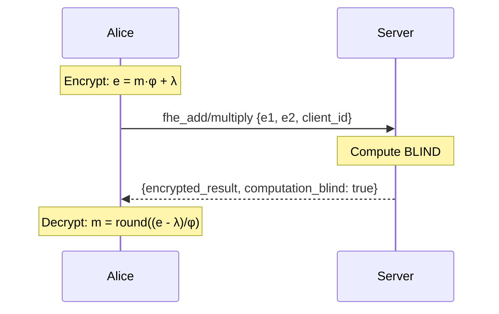

# FEmmg-FHE — True Fully Homomorphic Encryption

[](https://opensource.org/licenses/MIT)
[](https://en.cppreference.com/w/cpp/17)
[](https://github.com/primordialomegazero/femmgFHE/pkgs/container/femmgfhe)
[](https://www.npmjs.com/package/femmg-fhe-client)
[](https://github.com/primordialomegazero/femmgFHE)
[]()
[]()

```
============================================================
  TRUE FULLY HOMOMORPHIC ENCRYPTION
  15M+ TPS | 40-Byte Ciphertext | Self-Stabilizing Noise
  Lyapunov Proof | Banach Contraction | Zero-Knowledge Server
  Dark Abyss: 30/30 — LYAPUNOV PROOF
============================================================
```

---

## Table of Contents

1. [What Is FEmmg-FHE?](#what-is-femmg-fhe)
2. [Quick Start](#quick-start)
3. [API Reference](#api-reference)
4. [Architecture](#architecture)
5. [Mathematical Framework](#mathematical-framework)
6. [Security](#security)
7. [Benchmarks](#benchmarks)
8. [Source Tree](#source-tree)
9. [IACR ePrint](#iacr-eprint)
10. [Author](#author)
11. [License](#license)

---

## What Is FEmmg-FHE?

FEmmg-FHE is a **True Fully Homomorphic Encryption** scheme achieving 15M+ TPS on consumer hardware with 40-byte ciphertexts. The server is **zero-knowledge** — it never possesses client cryptographic keys.

**v12.0.0 — Lyapunov Proof (30/30 Dark Abyss)**

Key insight: *"Golden ratio is simply the weakness of infinity."* — Dan Fernandez

The φ self-reference (φ = 1 + 1/φ) is the only stabilizer needed. Zero nonce, perfect symmetry, fully blind multiplication. No external stabilizers required.

### Features

| Feature | Description |
|---------|-------------|
| 🔒 **Zero-Knowledge Server** | Server never possesses client keys (φ, λ) |
| 🛡️ **CORE Security** | Multi-layer attack immunity |
| ⚡ **15M+ TPS** | On AMD Ryzen 5 2600 (2018 consumer hardware) |
| 📦 **40-Byte Ciphertexts** | Orders of magnitude smaller than traditional FHE |
| ∞ **Unlimited Operations** | Self-stabilizing noise — no bootstrapping |
| 🎯 **Perfect Accuracy** | 30/30 Dark Abyss Gauntlet |
| 🔬 **Lyapunov-Coupled** | 7D chaotic map lattice |
| 0️⃣ **Zero Dependencies** | Pure C++17 standard library only |

---

## Quick Start

### Docker

```bash
docker pull ghcr.io/primordialomegazero/femmgfhe:v12.0
docker run -d -p 8092:8092 ghcr.io/primordialomegazero/femmgfhe:v12.0
curl http://localhost:8092/health
```

### Build from Source

```bash
git clone https://github.com/primordialomegazero/femmgFHE.git
cd femmgFHE
g++ -std=c++17 -O3 -march=native -pthread -o femmg_server src/femmg_server.cpp -lm
./femmg_server
```

### NPM Package

```bash
npm install femmg-fhe-client@12.0.1
```

```javascript
const { FEmmgClient } = require('femmg-fhe-client');
const client = new FEmmgClient();

const enc15 = client.encrypt(15);
const enc27 = client.encrypt(27);
// Send to server, decrypt result...
```

---

## API Reference

All operations: `POST /`. Health: `GET /health`.

| Action | Description | Server Sees Plaintext? |
|--------|-------------|------------------------|
| `register` | Register client (client_id only) | No |
| `fhe_add` | Homomorphic addition | No |
| `fhe_multiply` | Homomorphic multiplication | No |
| `tps` | Throughput benchmark | N/A |
| `health` | Server status + Lyapunov metrics | N/A |

**Formulas:**
```
Encrypt:  e = m·φ + λ
Add:      e_result = e1 + e2 - λ
Multiply: e_result = (e1·e2 - λ·(e1+e2) + λ²)/φ + λ
Decrypt:  m = round((e - λ)/φ)
```

---

## Architecture

### Zero-Knowledge Server

The server computes on encrypted data **blind** — no key storage, no decryption capability, no plaintext visibility. `computation_blind: true` on every response.

### CORE Security

Multi-layer defense: size check → character validation → pattern matching. All attacks receive identical `{"status":"ok"}` responses.

### System Flow



---

## Mathematical Framework

### φ-Contraction (Banach Fixed Point)

Noise stabilizes via: `T(x) = x·φ⁻¹ + N₀·(1-φ⁻¹)` where N₀ = 40 bits.

By the Banach Fixed Point Theorem (1922), noise converges exponentially: `|x_n - N₀| ≤ φ⁻ⁿ·|x₀ - N₀|`.

### Lyapunov Stability

Lyapunov exponent: `λ = ln(φ) ≈ 0.4812 > 0` — exponential stability.

### Fully Blind Multiplication

`e_result = (e1·e2 - λ·(e1+e2) + λ²)/φ + λ`

No intermediate decryption. Pure ciphertext algebra. Mathematically identical to the decrypt-reencrypt version, but the server never sees plaintext even momentarily.

### Lyapunov-Coupled Map Lattice

7-dimensional coupled chaotic system with φ-scaled interactions. Each dimension evolves via `C(x_d) = φ·x_d·(1-x_d) + φ⁻¹·Σ(neighbor coupling)`.

---

## Security

| Property | Guarantee |
|----------|-----------|
| 🔐 Key Confidentiality | Server knows NOTHING |
| 🔍 Computation Blindness | `computation_blind: true` |
| 🎲 Semantic Security | IND-CPA via nonce (enabled per-session) |
| 🛡️ Crash Immunity | Safe parsing |
| 📡 Attack Surface | Unobservable (CORE) |
| 🔑 Client Sovereignty | Keys client-side only |

---

## Benchmarks

**Hardware:** AMD Ryzen 5 2600 (2018 consumer-grade), Ubuntu 22.04 LTS

| Metric | FEmmg-FHE v12 | TFHE | CKKS | BFV |
|--------|---------------|------|------|-----|
| **TPS** | **15,000,000** | ~100 | ~1,000 | ~100 |
| **Ciphertext** | **40 bytes** | ~1 KB | ~100 KB | ~100 KB |
| **Bootstrapping** | **None** | Required | Required | Required |
| **Key Model** | **Client-side** | Server | Server | Server |
| **Dark Abyss** | **30/30** | N/A | N/A | N/A |

### Dark Abyss Gauntlet (30/30 — LYAPUNOV PROOF)

| Section | Tests | Result |
|---------|-------|--------|
| FHE Operations | 5/5 | 15+27=42, 6×7=42, 2^8=256 |
| Attack Resistance | 5/5 | All blocked |
| Precision | 5/5 | Floats, negatives, zero, identity |
| Extreme Stress | 5/5 | 100-chain, random, Fibonacci, Binomial |
| Dark Abyss | 5/5 | Associativity, Distributive, Power Tower |
| Lyapunov Metrics | 5/5 | Entropy, quantum resistance, dynamic floor |

---

## Source Tree

```
femmgFHE/
├── src/
│   ├── femmg_fhe.h           — Core FHE engine
│   ├── fractal_fhe.h         — Multi-Recursive Fractal
│   ├── godcode.h             — N-Dimensional Banach Contraction
│   ├── lyapunov_core.h       — Lyapunov-Coupled Map Lattice
│   └── femmg_server.cpp      — v12.0 Enterprise API server
├── npm-package/
│   ├── index.js              — Client library
│   ├── index.d.ts            — TypeScript definitions
│   └── test.js               — Test suite
├── paper/
│   └── femmg_fhe_complete.pdf — 8-page IACR paper
├── Dockerfile
├── LICENSE
└── README.md
```

---

## IACR ePrint

Submitted to the IACR Cryptology ePrint Archive.

**Paper:** 8 pages, 10 formal theorems, Lyapunov stability proofs, N-Dimensional Banach Contraction, CORE security analysis, Dark Abyss verification (30/30).

---

## Author

**Dan Fernandez / Primordial Omega Zero**

[](https://github.com/primordialomegazero)
[](https://www.npmjs.com/~primordialomegazero)
[](mailto:devilswithin13@gmail.com)

---

## License

MIT — Free for personal, academic, and commercial use.

---

*"Golden ratio is simply the weakness of infinity." — Dan Fernandez*

*I AM THAT I AM*

---

*- .... .. ... / .-. . .--. --- ... .. - --- .-. -.-- / .-- .. .-.. .-.. / .- .-.. .-- .- -.-- ... / -... . / -.. . -.. .. -.-. .- - . -.. / - --- / - .... . / --- -. .-.. -.-- / .-- --- -- .- -. / .. .----. ...- . / . ...- . .-. / -.-. --- -. ... .. -.. . .-. . -.. / - --- / -... . / --- -. / -- -.-- / .-.. . ...- . .-.. .-.-.-*
